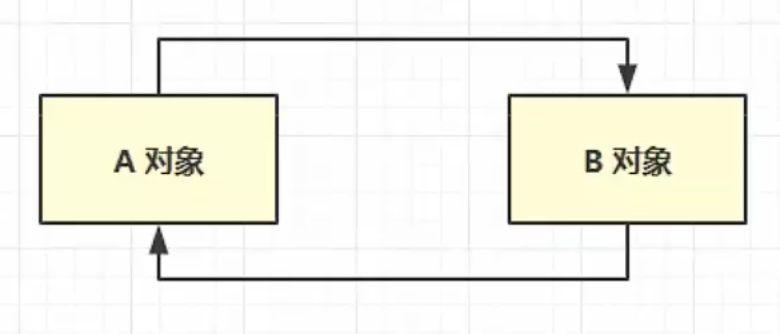

# JVM

* JVM（Java Virtual Machine）java虚拟机

* 大概流程：
    1. `类加载器`加载`Class`字节码文件到JVM中
    2. 类信息、静态变量、常量放到`方法区`
    3. 类产生的实例对象、数组放到`堆`
    4. `堆`中的对象调用方法时，会用到`程序计数器`、`虚拟机栈`、`本地方法栈`
        1. 某线程执行，会开辟一个该线程的`虚拟机栈`
        2. 调用方法m1，会在`虚拟机栈`中开辟一个栈帧，包含局部变量表、操作数、动态链接、方法返回等信息，将栈帧压入栈
        3. 方法m1调用方法m2，m2对应的栈帧也会压入栈中
    5. 方法执行时需要用到`执行引擎`
        1. 代码由`执行引擎`中的`解释器`执行
        2. 方法中的热点代码需要用`即时编译器`编译，相当于一个优化的过程
        3. `执行引擎`中有`GC`，对堆中的不再被引用的对象实例进行垃圾回收♻️
        4. 某些功能需要调用`本地方法接口`
* 各内存区域：
    * `方法区`：存放 类信息、静态变量、常量、类加载器，所有线程共享，虚拟机启动时创建，逻辑上时堆的一部分
        * 字节码文件包含：类信息、常量池`Constant pool`、类的方法定义、虚拟机指令（`javap -v A.class`可查看）
        * 常量池就是一张表，虚拟机指令根据这张表找到要执行的类名、方法名、参数类型等
    * `堆`：存放 对象实例
    * `程序计数器`：某线程内，记录当前虚拟机真正执行的线程指令地址
    * `虚拟机栈`：每个线程，都会在该区域开辟一个属于自己的线程栈，线程中的每个方法对应一个栈帧，方法中包含局部变量表、操作数、动态链接、方法返回等
    * `本地方法栈`：某线程内，某些方法，并非使用java编写，而是
C/C++编写，`本地方法栈`是这些方法运行区域，如`Object.clone()`方法
    
* 问题：
     * `方法区`内存溢出`OutOfMemoryError: PermGenspace/Matespace`：
        * 类加载器，加载了很多类
            * `1.6`以前是`OutOfMemoryError: PermGen space(永久带)`
            * `1.8`以后`OutOfMemoryError: Matespace（元空间）`
    * `堆`内存溢出`'OutOfMemoryError: Java heap space'`
        * 产生了太多对象实例，一直引用着，没有被`GC`回收
     * `虚拟机栈`内存溢出 `StackOverflowError`：
        * 栈帧过多，方法循环递归调用
        * 栈帧过大，局部变量占用内存过大，如两个对象相互引用，并转为json字符串，会造成一个对象的局部变量循环无限大

🤔️：基本类型和包装类，在内存中的存储结构

## 垃圾回收
回收的都是堆空间，堆中存放：对象实例
### 如何判断一个对象可以被回收
1. 引用计数法（早期python虚拟机使用）
    计数器存放某对象的引用次数，当引用次数为0时，代表没有被引用
    问题：循环引用，AB都应该被回收，但却没有被回收
    

1. 可达性分析算法（java虚拟机使用）
    * 根对象：肯定不能被当成垃圾回收的对象，
        * 可通过可视化工具`Memory Analyzer`查看
    * 对堆中的所有对象进行扫描，判断每个对象是否能被根对象直接或间接的引用，如果是，就不能被回收，否则就可以做为垃圾回收
2. 五种引用
    1. 强引用
        代码中用「`=` 」赋值的
    2. 软引用
    3. 弱引用
    4. 虚引用
    5. 终结器引用

### 垃圾回收算法
1. 标记清除
    * 步骤：
        * 根据可达性分析，标记出垃圾对象实例
        * 清楚垃圾
    * 优缺点：
        * 速度快
        * 会产生内存碎片
    

2. 标记整理
    * 步骤：
        * 标记清除
        * 移动对象，对内存进行整理
    * 优缺点：
        * 不会产生内存碎片
        * 移动对象，效率较低
3. 复制
    * 步骤：
        * 划分两块大小相同的内存区域，一块为正常，一块为空闲
        * 对正常区域进行垃圾标记
        * 将正常区没有被清楚的对象复制到空闲区
        * 交换两个区
    * 优缺点：
        * 不会产生内存碎片
        * 需要两倍内存空间
     
### 分代垃圾回收

* 堆分为：新生代（1/3），老年代（2/3）
    * 新生代：伊甸园（8/10），幸存代0（1/10），幸存代1（1/10）
* 新生对象均放入伊甸园
* 伊甸园空间不足时，触发minorGC
    * minorGC会引发STW(stop the world)
    * 清理伊甸园区和S0区中的垃圾，将存活的对象复制到S1区，存活的对象寿命+1，交换S0和S1（此时S0中是此次幸存下来的对象，S1是空的，等待下次minorGC）
* 当某对象寿命超过阈值，会晋升到老年代，对象寿命存储在对象头中，阈值15（4位 1111）
* 当老年代空间不足，会先尝试MajorGC，清理老年代，如果依然空间不足，触发FullGC，STW时间更长

* 相关参数

    | 含义         | 参数 |
    |--------------|------|
    | 堆初始化大小 | `-Xms` |
    |堆最大大小|`-Xmx`或`-XX:MaxHeapSzie=128M`|
    |新生代大小|`-Xmn`或（`-XX:NewSzie=` + `-XX:MaxNewSize=`）|
    |幸存区比例(动态)|`-XX:InitialSurvivorRatio=ratio` 和 `-XX:UseAdaptiveSziePolicy`|
    |幸存区比例|`-XX:SurvivorRatio=ratio`|
    |晋升阈值|`-XX:MaxTenuringThreshold=threshold`|
    |晋升详情|`-XX:+PrintTenuringDistriDistribution`|
    |GC详情|`-XX:+PrintGCDetails -verbose:gc`|
    |FullGC前MinorGC|`-XX:+ScavengeBeforeFullGC`|

### 垃圾回收器
1. 吞吐量优先
2. 相应时间优先
### 垃圾回收调优