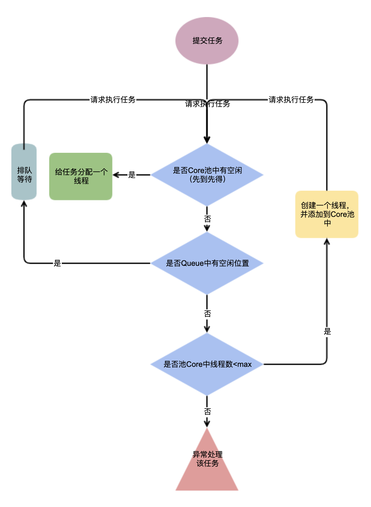

# JAVA基础

## 1.手动从源文件到jar
1. 手动编写java源文件，放入src目录下
    源文件：`com/cl/bases/a/A.java`
    ```
    package com.cl.bases.a;
    
    import java.util.Date;
    import com.cl.bases.utils.Utils;
        
    public class A{    
        public static void main(String[] args) throws InterruptedException{
            while(true){
                System.out.println(Utils.SDF1.format(new Date()));
                Thread.sleep(1000);
            }
        }
    }
    ```
    源文件：`com/cl/bases/ultras/Utils.java`
    ```
    package com.cl.bases.utils;

    import java.text.SimpleDateFormat;
    
    public class Utils{
        public static SimpleDateFormat SDF1=new SimpleDateFormat("yyyy-MM-dd HH:mm:ss");
    }
    ```
    
2. 编译源文件为class
    1. 不指定编译目录：
        ```
        javac -classpath ./src src/com/cl/bases/a/A.java
        # 编译A.java
        # -classpath ./src 指定类路径
        # A中`import com.cl.bases.utils.Utils`自定义类，编译时需要指定「查找用户类文件和注释处理程序的位置」
        # 可简写为 javac -cp ./src src/com/cl/bases/a/A.java
        
        # 编译后生成的`.class`文件在src中
        java -cp ./src com.cl.bases.a.A     # 运行
        ```
    2. 指定编译目录为`target`：
        ```
        javac -cp ./src -d ./target src/com/cl/bases/a/A.java
        # 将.class文件生成到`./target`下
        
        java -cp ./target com.cl.bases.a.A  # 运行
        ```
3. 打包class为jar
    1. 不指定清单文件打包
        ```
        jar -cvf ./out/my.jar -C ./target .
        # -cvf 创建新文件 显示详细 指定文件名
        # -C ./target . 指定target目录下所有文件
        
        java -cp ./out/my.jar com.cl.bases.a.A
        # 不指定清单文件，运行时需要指定类路径 ./out/my.jar com.cl.bases.a.A
        ```
    2. 指定清单文件打包
        1. 编写清单文件`MANIFEST.MF`，内容如下，注意⚠️Main-Class后一定要有下一空行
        ```
        Manifest-Version: 1.0
        Created-By: 1.8.0_161 (Oracle Corporation)
        Main-Class: com.cl.bases.a.A

        ```
        2. 执行命令
        ```
        jar -cvfm out/my.jar MANIFEST.MF -C ./target/ .
        # 指定清单文件打包
        
        java -cp ./out/my.jar com.cl.bases.a.A  # 运行
        java -jar ./out/my.jar  # 运行
        ```
    1. 更新清单文件
        ```
        jar -uvfm ./out/my.jar MANIFEST.MF
        ```
    * 拓展
        * SpringBoot启动：
            * springboot打包的jar，清单文件中主启动类`org.springframework.boot.loader.JarLauncher`
            * 直接指定类路径，也可以运行
                ```
                java -cp xxx-1.0-SAPSHOT1.jar org.springframework.boot.loader.JarLauncher
                # 
                ```
            * 但不能指定自己的主启动类，因为主启动类在xxx/BOOT-INF/classes 下，二不在xxx根下，需解压后，也可以分别指定所有类路径，才可运行
                ```
                java -cp \
                    xxx/:\
                    xxx/BOOT-INF/classes/:\
                    xxx/BOOT-INF/lib/spring-boot-autoconfigure-2.6.6.jar:\
                    xxx/BOOT-INF/lib/spring-boot-2.6.6.jar:\
                    ...\
                     com.cl.learn.Application
                ```
        * [包含自定义jar打包](https://github.com/CLgithub/Intellij_SpringBoot_Rebuild-Lib)
4. 运行
    各个参数结合[JVM各内存区域](./JVM.md)
    ```
    -X #扩展参数
    堆内存：对象引用，堆内存溢出：'OutOfMemoryError: Java heap space'
        -Xms：堆内存初始化大小
            缺省单位：字节Byte，缺省大小：2MByte，该大小为1024的整数倍并且要大于1MB
        -Xmx：堆内存最大可用大小
            缺省单位：字节Byte，缺省大小：64MByte，该大小为1024的整数倍并且要大于2MB

    栈内存：线程栈，栈内存溢出：StackOverflowError
        -Xss：线程栈大小
            缺省单位：字节Byte，缺省大小：1MByte
            
    java -Xms1024M -Xmx2048M -Xss128M -jar my.jar   # 堆初始化1G最大2G，栈128M运行
    java -Xms1024M -Xmx2048M -Xss128M -cp my.jar com.cl.bases.a.A
    ```
1. 堆大小设置结合GC

### 用maven手动从源文件到jar
1. 构建项目目录结构
    ```
    |-- pom.xml
    `-- src
        |-- main
        |   |-- java
        |   `-- resources
        `-- test
            `-- java

    ```
2. 在`pom.xml`中写入以下内容：
    ```
    <?xml version="1.0" encoding="UTF-8"?>
    <project xmlns="http://maven.apache.org/POM/4.0.0"
             xmlns:xsi="http://www.w3.org/2001/XMLSchema-instance"
             xsi:schemaLocation="http://maven.apache.org/POM/4.0.0 http://maven.apache.org/xsd/maven-4.0.0.xsd">
        <modelVersion>4.0.0</modelVersion>
    
        <groupId>com.cl.learn.bases</groupId>
        <artifactId>srcToJar</artifactId>
        <version>1.0-SNAPSHOT</version>
    
    </project>
    ```
3. 在`src/main/java/com/cl/learn/bases/SrcToJar.java`文件文件中写入以下内容：
    ```
    package com.cl.learn.bases;

    public class SrcToJar{
    	public static void main(String[] args){
    		System.out.println("hello!");
    	}
    }
    ```
4. 输入命令：
    ```
    mvn package # 用maven打包，自动创建target目录
    java -cp ./target/srcTojar-1.0-SNAPSHOT.jar com.cl.learn.bases.SrcToJar # 指定主启动类启动
    ```
* 打包时添加插件添加主清单文件指定主启动类：
    ```
    <?xml version="1.0" encoding="UTF-8"?>
    <project xmlns="http://maven.apache.org/POM/4.0.0"
             xmlns:xsi="http://www.w3.org/2001/XMLSchema-instance"
             xsi:schemaLocation="http://maven.apache.org/POM/4.0.0 http://maven.apache.org/xsd/maven-4.0.0.xsd">
    	<modelVersion>4.0.0</modelVersion>
    
    	<groupId>com.cl.learn.bases</groupId>
    	<artifactId>srcTojar</artifactId>
    	<version>1.0-SNAPSHOT</version>
    
    	<build>
    		<plugins>
    			<plugin>
    				<groupId>org.apache.maven.plugins</groupId>
    				<artifactId>maven-jar-plugin</artifactId>
    				<version>2.4</version>
    				<configuration>
    					<archive>
    					   <!-- 添加主清单文件 -->
    						<manifest>
    							<mainClass>com.cl.learn.bases.SrcToJar</mainClass>
    						</manifest>
    					</archive>
    				</configuration>
    			</plugin>
    		</plugins>
    	</build>
    </project>
    ```
    
    
## 2.JDK 与 CGLIB 动态代理
[参考](https://www.yuque.com/renyong-jmovm/dadudu/bnfwbc)
### CGLIB
* 使用：
    ```
    // 1 创建增强器
    Enhancer enhancer=new Enhancer();
    // 2 设置要被代理的类
    enhancer.setSuperclass(clazz);
    // 3 设置自定义方法拦截器
    enhancer.setCallback(new MyMethodInterceptor());
    // 4 创建代理对象
    T t= (T) enhancer.create();
    ```
* 原理：
整体思路：
    * 创建增强器，将 被代理对象 自定义方法拦截器 封装为一个key
    * 根据key，确定代理类前缀等信息，创建代理类 `data = new ClassLoaderData(loader);`
    * 得到代理类的`CGLIB$SET_THREAD_CALLBACKS`方法 并用`null 去 invoke`该方法(static的)
        * 代理类的`CGLIB$SET_THREAD_CALLBACKS`方法，对`ThreadLocal进行了set(callback[])`设置自定义方法拦截器，备用
    * 创建代理类 `ReflectUtils.newInstance(type);` asm相关知识
    * 从而在代理对象调用test方法时，能解释获取到自定义的callback，并执行其中的intercept方法，从而实现增强
        * 自定义方法拦截器中执行方法
        * 正常invoke需要走反射，比较慢
        * methodProxy.invoke 或 methodProxy.invokeSuper，最根本都是去执行 Fast类的invoke

        * Fast类中对方法标注下标，invoke时不走反射，直接根据下标去找到对应方法执行

## 3.反射以及字节码
### asm与javassist
### 反射（待填）

## 4.线程池
* 线程池线程获取流程，[详情](../4threadPool/src/main/java/com/cl/learn/threadpool/ExecutorsTest.java)


## 5.内部类

### 修饰符

|  | public|protected|default|private|
|:--|:--|:--|:--|:--|
|同一个类|✅|✅|✅|✅|
|同一个包|✅|✅|✅|❌|
|子类|✅|✅|❌|❌|
|其他包|✅|❌|❌|❌|

特殊的：protected，子类对象才能访问，若是静态变量，父类子类都可以直接访问
