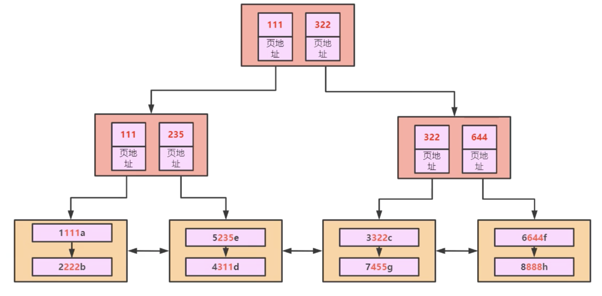
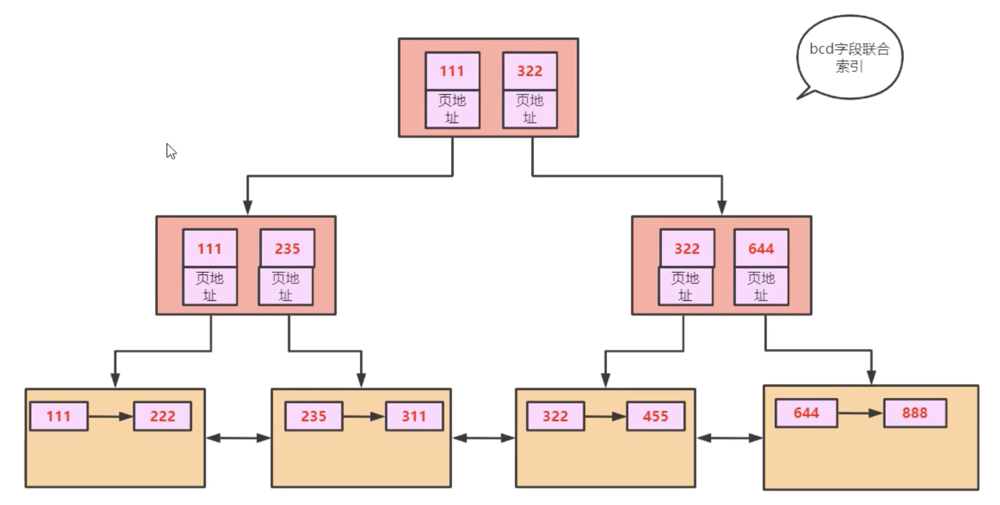
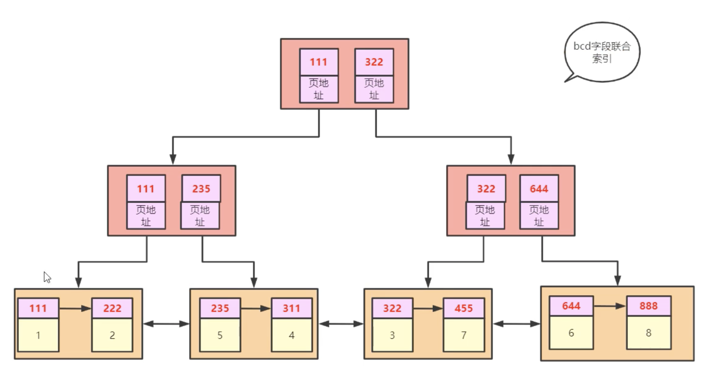
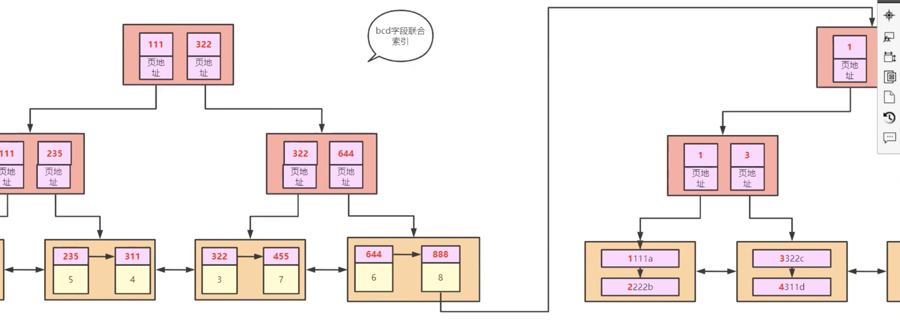
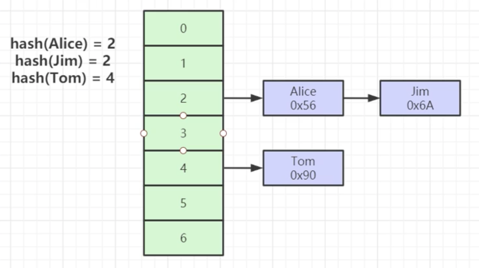
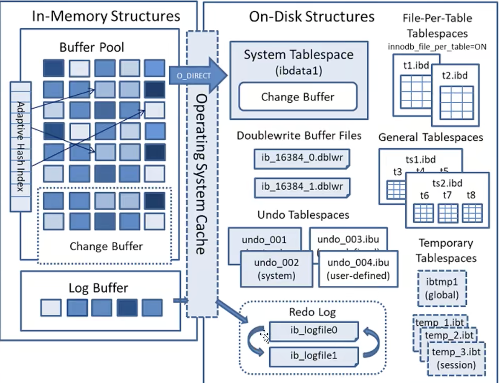
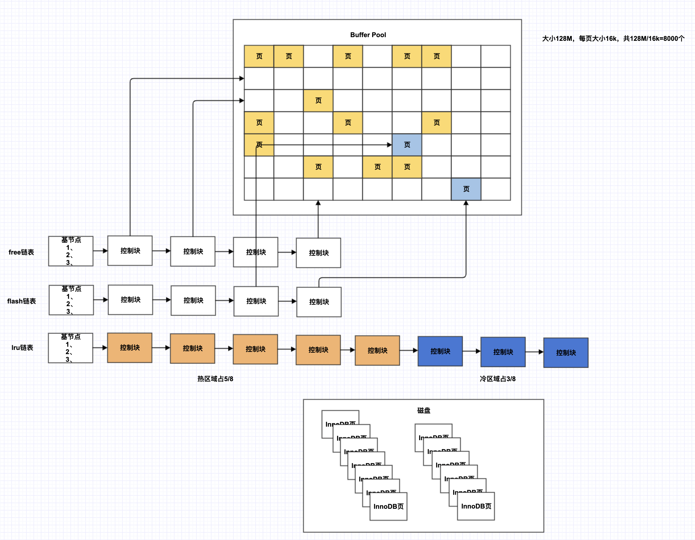
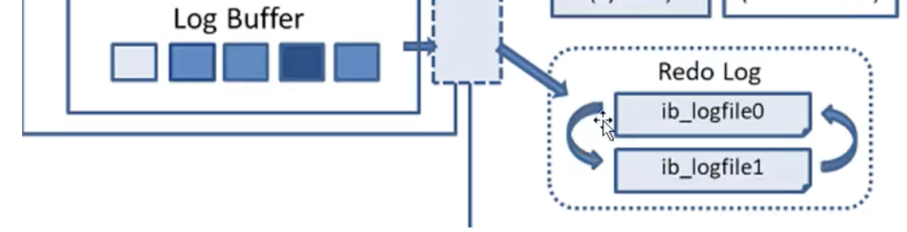
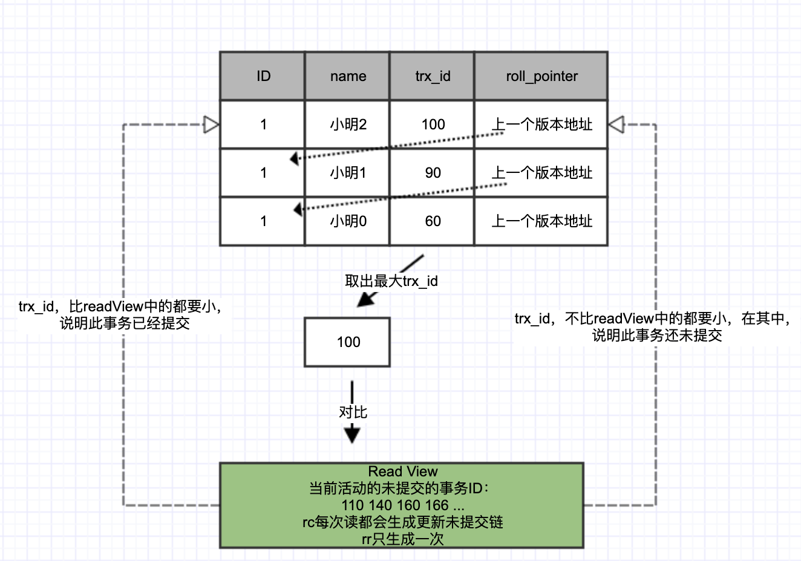

# MYsql基本数据类型

* 数值类型：

  * 整型：TinyInt(8位1字节)、SmallInt(16位2字节)、MediumInt(24位3字节)、Int(32位4字节)、BigInt(64位8字节)

  ```mysql
  create table t1(
  	year int(4)	# int(4) 只是显示宽度，和数值大小无关
  );
  ```

  * 浮点型：float(32位)、double(64位)
  * 定点小数类型：decimal(M,D)(M+8位)

* 字符串类型：

  * char，定长字符串，0~255字符
  * varchar，变长字符串，0～65535字节
  * binary，定长字节串，0~255字节
  * varbinary，变长字节串，0～65535字节

* 日前/时间类型


# 索引

## 索引基本结构

   MySQL索引时帮助MySQL高效获取数据的 **排好序** 的 **数据结构**

   * 索引数据结构，每个节点<k,v> <索引,数据磁盘文件地址>

     * 二叉树：每个节点最多只有两个分支的有序树结构
       * 二叉查找树：本质是一种二叉树，但每个节点左子树的所有节点值均小于它的跟节点的二叉树
     * 红黑树（平衡二叉树）：叶节点高度差的绝对值不超过1，每个节点都 **带有颜色** 属性的 **二叉查找树**，
     * Hash表
     * B-Tree：一个节点可以有多个子节点的红黑树

     ```mysql
     # 以二叉树为例
     select * from t where t.col2=89; # 从根节点开始查找，两次就能查到
     # 但Mysql并不以二叉树为索引，因为存在问题如：
     select * from t where t.col1=6;	# col1放在二叉树里类似链表
     ```

     

     ```mysql
     # 红黑树为例 只需要查找3次
     select * from t where t.col1=6; # 早期间mysql使用平衡二叉树，现在已经不使用
     # 红黑树的问题在于数量量大时，树 的高度较高
     ```

      

     为了改进红黑树树高较高的问题，可以在一个节点里 横向 按序 多放几个元素，就形成了[B Tree](https://www.cs.usfca.edu/~galles/visualization/BTree.html)，度为4，相当于4进制，逢4分裂，每个节点最多放3个元素，每个节点最多有4个分支

     

     对B Tree再进行改进，得到[B+Tree](https://www.cs.usfca.edu/~galles/visualization/BPlusTree.html)

     

     B树和B+树区别：

     * B树叶子节点之间没有相互维护的指针
     * B+树叶子节点有冗余数据，其实冗余并不多，但可以大大提升效率


## MySQL索引

MySQL索引采用 B+树结构，有以下特点
* 排好序

* 一个节点(page)有多个元素

* 叶子节点用指针连接，提高区间访问的性能

* 非叶子节点不存储data，只存储索引(冗余)，是索引页，起到分组的作用，方便叶子节点长链表的快速查找

* 叶子节点包含所有索引以及数据地址，是数据页


         

```mysql
show global status like 'innodb_page_size'; # innoDB页大小
# 16384=1024*16
# 每个大节点大小为16k Byte
# mysql中int和java中int占位一样（32位4字节），bigint相当于java中的long（64位8字节）
# 若用bigint类型的字段做索引 每个跟节点可防止16384/(8+6)=1170.2857142857个索引 
# 若树高为h，每个叶子节点放索引和数据需要1kB，
# 则共能放 16*(1170)^(h-1)，若h=3，=21902400

create table t1(
	a int primary key,
  b int,
  c int,
  d int,
  e varchar(20)
)engine=InnoDB

# 显示t1表的索引
show index from t1; # 目前有一个索引

# 乱序逐行插入数据
INSERT into t1 values(4,3,1,1,'d');
INSERT into t1 values(1,1,1,1,'a');
INSERT into t1 values(8,8,8,8,'h');
INSERT into t1 values(2,2,2,2,'b');
INSERT into t1 values(5,2,3,5,'e');
INSERT into t1 values(3,3,2,2,'c');
INSERT into t1 values(7,4,5,5,'g');
INSERT into t1 values(6,6,4,4,'f');

select * from t1; # 插入的时候就已经排序

select * from t1 where a=7; # 不加索引需要7次磁盘io，加了B+树索引，只需要1次磁盘io，因为innoDB_page_size为16kB，直接就在根大节点内
```


InnoDBpage         

* InnoDB页内部结构       
  
       

在插入的时候就会按主键进行逻辑排序，但会页内部会形成链表（插入快，查询慢）

利用「页目录」提升查询速度，对数据进行分组，页目录中存储每一组首数据主键，查询时先利用二分查找确定在哪组


       

* 走索引：从根页往下查找
* 不走索引：全表扫描，从叶子节点最左侧逐个查找
  
```mysql
explain select * from t1 where a=5; # 走索引 const PRIMARY
explain select * from t1 where a>7; # 走索引 range PRIMARY
explain select * from t1 where c=7; # 不走索引，全表扫描
```


## 联合索引

```mysql
create index idx_t1_bcd on t1(b,c,d);	# B+
```


每创建一个索引，就生成一颗B+树，会带来两个问题：

* 数据冗余
* 更新麻烦

所有考虑只冗余bcd三个字段



```mysql
explain select * from t1 where b=1 and c=1 and d=1; # 走索引 但是只能查出bcd字段，*字段不能查出 ref idx_t1_bcd
```

所有在叶子节点上再记录这一行的主键



这样并不完全冗余，只冗余必要的信息，索引字段和主键字段，查找的时候先通过索引找到主键，再通过主键索引树去查找*字段（会表）



### 最左前缀原则

存储方式按字段逐个比较

```mysql
explain select * from t1 where b=1; # 走索引 ref idx_t1_bcd 先索引再回表，相当于用1** 去bcd索引树中查找
explain select * from t1 where b>1; # 不走bcd索引，走全表扫描，因为走全表扫描更快（走索引只能定位1**，后面的需要7次回表，不如全表扫描）仅限于5.7版本，mysql8走了索引
explain select * from t1 where b>6; # 走索引 range idx_t1_bcd（只需要一次回表）
explain select b from t1 where b>1; # 走索引 range idx_t1_bcd（直接得出）
explain select b,c,d from t1 where b>1; # 走索引（直接得出） range idx_t1_bcd
explain select b,c,d,a from t1 where b>1; # 走索引（a是主键，也可以直接得出） range idx_t1_bcd

explain select b from t1;	# 走索引 index idx_t1_bcd

# 若加上
create index idx_t1_e on t1(e);

explain select * from t1 where e=1; 	# ALL
explain select * from t1 where e='1'; # ref idx_t1_e
explain select * from t1 where a=1; 	# const PRIMARY
explain select * from t1 where a='1';	# const PRIMARY
```

联合索引优化原则：最左前缀原则

* where后的条件安联合索引字段来查询，不能跳过，若跳过了之后后面的字段就不会走
* 该原则原因：看联合存储方式，联合索引字段逐个比较后存储


## 执行计划

执行计划就是sql的执行查询的顺序，以及如何使用索引查询，返回的结果集的行数

Explain关键字：使用explain关键字可以模拟优化器执行sql语句，分析你的查询语句或是结构的性能评价。在select语句之前添加explain关键字，Mysql会在查询上设置一个标记，执行查询会返回执行计划的信息，而不是执行这条sql，注意：如果from中包含子查询，仍会执行孩子查询，将结果放入临时表中

```mysql
explain select * from t1 where a=1 and b=1
```

1. id：是一个有顺序的编号，是查询的顺序号，有几个select就显示几行，id的顺序是按select出现的顺序增长的。id列的值越大执行优先级越高越先执行，id列的值相同则从上往下执行，id列的值为NULL最后执行
2. select_type：表示查询中每个select子句的类型
   * simple（简单）：查询不包含union查询或子查询
   * primary（主要）：此查询是最外层的查询（包含子查询）
   * subquery：子查询中的第一个select
   * union：此查询是union的第二或随后的查询
   * dependent union：union中的第二个活后面的查询语句，取决于外面的查询
   * union result，union的结果
   * dependent subquery：子查询汇总的第一个select，取决于外面的查询，即子查询依赖于外层查询的结果
   * derived：衍生，表示到处表的sleect（from子句的子查询）
3. table：该语句查询的表
4. partitions：
5. **type**：执行效率：ALL < index < range < ref < eq_ref < const < system，最好避开ALL和index
   1. system：表中只有一行记录
   2. const：将主键置于where条件，并能转换为一个常量
   3. eq_ref：唯一性索引扫描，对每个索引键，表中只有一条记录与之匹配，走回表
   4. ref：非唯一性索引扫描，返回匹配某个值的所有数据，走回表（先在非聚合索引查询，再到主键索引中去查询）
   5. range：范围查找，一般出现在between、<、>
   6. index：扫描所有索引树
   7. ALL：全表扫描
6. possible_keys
7. key
8. Key_len
9. ref
10. rows：读取多少行
11. filered
12. Extra：排序的时候是否有走索引
    1. using filesort
    2. using index
    3. using tempoary
    4. using where


## MyISAM 与InnoDB 存储引擎

MyISAM 和 InnoDB 分别是mysql的两种存储引擎，存储引擎作用与表，MyISAM已经很少用了，两者都用B+树结构索引，区别在于，MyISAM 的叶子节点放索引地址，InnoDB 的叶子节点放的是整行的数据（同时放数据和索引）

 * MyISAM 有3个文件，.frm放表结构，.MYD放数据，.MYI放索引，目前MyISAM已经很少用了

 * InnoDB 两个文件，.frm放表结构，.idb放数据和索引

    * 表数据文件本身就是按B+树组织的一个索引结构文件
    * 聚集索引：叶子节点包含了完整的数据记录
    * 为什么建议InnoDB表建主键，并且推荐使用整型自增主键？（若不建主键，mysql会自己去找一列，或自己去维护一列当作索引，会消耗数据库资源。整型方便比对，自增可以每次都插入到最后，可能会导致树结构平凡变动，消耗资源。所以不要用UUID做主键，非整型长而非自增）
    * 主键索引存储方式，叶子节点放索引和整行数据

    

   * 非主键索引存储方式，叶子节点放该列数据和该行主键。为什么？（一致性和节省存储空间）

     


## Hash索引

Mysql索引还可以是hash索引

* 对索引的key进行一次hash计算就可以定位出数据存储的位置
* 很多时候Hash索引要比B+树索引更高效
* 仅能满足“=”，“IN”，不支持范围查询
* hash冲突问题




# 事务

## Buffer Pool






Bufferpool默认128M，每页大小16k，所以共8000个

* free链表：指向Bufferpool中的空页，新从磁盘获取某页时，在此链表中查找空页位置
* flash链表：指向Bufferpool中的脏页，脏页内存中修改了数据，需要同步到磁盘的页，如何同步
  * 有一个线程定时去执行，1s/10s执行一次，但并不可靠，假设还等不到线程，mysql就挂了，修改的数据就会丢失
  * 通过redolog（其实就是事务的过程）
    * 1、修改bufferpool的数据--->脏页
    * 2、Update语句--->生成一个redolog--->存在log Buffer中
    * 3、redolog持久化（何时进行持久化：事务commint时，此时binlog也要持久化）
    * 4、返回修改成功
    * 5、数据库挂掉，
    * 6、重启mysql，会从redo进行数据恢复
    * 7、select获取数据时，
* lru链表：bufferpool有限，需要淘汰机制，按最近使用最少淘汰，没使用某一页，就会把某页的控制块移动到链表最前端，淘汰最末端
  * 但若有全表扫描：```select * from t1;```切表数据特别大时，回逐个逐个淘汰掉热数据，造成换血现象，热数据又得再次进行加载，为了避免这种换血现象，将链表分为5/8的热区域(5000个)，3/8的冷区域，当一个新页从磁盘加载时，会先进入冷区域的头节点，当该页第二次被访问时，如果访问时间间隔第一次访问>1s，就将其移动到热区域头节点，否则继续呆着冷区域（全表扫描逐行访问数据，每页有多行数据，第二次访问的时间肯定<1s），来避免对热区域的换血

事务执行过程

1. 修改bufferpool的数据--->脏页
2. Update语句--->生成一个redolog--->存在log Buffer中
3. redolog持久化（何时进行持久化：事务commint时）
4. binlog持久化
5. undolog （进行反向操作，事务rollback时执行 ）
6. 返回修改成功


### redolog



redolog时innodb中的概念

记录的是：对于某一页而言，哪个位置的数据进行了修改

redolog默认有两个文件，每个48M，大小个数可设置，当一个满时，会触发「检查点」，检查已经持久化到磁盘的update sql，清理掉这条log，经常触发检查点会影响性能

redolog持久化：生成一个redolog--->存在log Buffer--->操作系统缓存--->存入磁盘

innodb_flush_log_at_trx_commit配置项

| 值   | 描述                                                         |
| :--- | ------------------------------------------------------------ |
| 0    | 表示事务提交时，不立即对redolog进行持久化，这个任务交给后台线程去做（1s/10s去做一次） |
| 1    | 表示事务提交时，立即吧redolog进行持久化                      |
| 2    | 表示事务提交时，立即将redo log写到操作系统的缓冲区，并不会直接将redolog进行持久化，这种情况下，如果数据库挂了，但是操作系统没挂，那么事务的持久性还是可以保证的 |

### undolog

* 可以理解为反向操作的日志，用于事务回滚，保证事务原子性

### binlog

* mysql中的一个概念，记录一些sql，主要用在主从数据库同步
* InnoDB如何保证binLog和redoLog一致：redoLog写盘，事务进入prepare(准备)状态，如果前面prepare成功，binLog也进行写盘将事务日志持久化到binLog，如果binLog写盘成功，事务则进入commit状态（在redoLog中写入commit记录），redoLog刷盘将事务日志持久化到redoLog(操作系统空闲时)


## 事务的基本特性和隔离级别

基本特性（ACID）：

* 原子性（Atomicity）：要么都成功，要么都不成功
* 一致性（Consistency）：指数据库总是从一个一致性的状态转换到另一个一致性的状态
* 隔离性（Isolation）：事务之间相互隔离，但有不同的隔离级别
* 持久性（Durability）：事务一旦执行，对数据将产生持久性的影响


不同隔离级别对事务的影响：

* 读未提交（read uncommit）：读取到其他事物为提交的数据，带来的问题：脏读
* 读提交（read commit）：读其他事务提交了的数据，带来的问题：不可重复读
* 可重复读（repeatable read）：可以重复读，每次读取的都其他事务已经提交的数据，都一样，mysql的MVCC，rc和rr时回生成read view，rc时每次都是新的，rr时只生成一次带来的问题：幻读（readview只针对查询操作，一个事务按相同的查询条件重新读取以前检索过的数据，却发现其他事务插入了满足其查询条件的新数据，幻读和不可重复读有些类似，但是幻读强调的是集合的增减，而不是单条数据的更新），mysql默认
* 串行化（serializable）：加锁，带来的问题：导致大量超时和锁竞争


基本特性（ACID）是如何保证的：

* 一致性：是目的，通过其他三个来保证
* 原子性：undolog，没有成功就回滚
* 隔离性：MVCC(多版本并发控制)
* 持久性：redoLog（binlog也可以）


**MVCC**：多版本并发控制

读取数据时通过一种类似快照的方式将数据保存下来，这样读锁就和写锁不冲突，不同的事务session会看到自己特定版本的数据，版本链

只在read commit和repeatable read级别下工作，其他两个隔离级别和MVCC不兼容

聚簇索引记录中，有两个必要隐藏列

* trx_id：用于存储每次某个聚簇索引记录进行修改时候的事务id，事务操作记录，会把事务id存在记录中（最终会保存多个不同时间操作此记录的事务id）

* roll_pointer(滚动指针)：每次对聚簇索引记录有修改，都会把老版本写入undoLog中。roll_pointer保存一个指针，指向聚簇索引记录的上一个版本，通过他来获取上一个版本记录，上一个版本记录中也有一个roll_pointer指针，指向上上个版本

  

read commit和repeatable read的区别就在于生产readView的策略不同，从而影响了快照的生成，从而查询到不同的数据

确定数据快照(最后一次提交的样子)的方法：

开始事务时创建readView，readView维护当前活动的事务id(未提交的事务id)，排序生成一个数组 

访问数据，获取数据中保存的多个事务id，trx_id，取最大的id，对比readView，

如果trx_id比readView中的都小，访问当前记录的事务的最大id，比未提交的事务id都要小，在所有未提交之前，说明trx_id已经提交，就将此记录作为快照

如果trx_id不比readView中的都小，访问当前记录的事务的最大id，不比未提交的事务id都要小，在所有未提交之中，说明trx_id还未提交，那就去此条记录的roll_pointer获取上一个版本，再次进行比对，确定快照记录


## 事务的传播属性


## Mysql锁🔒的类型

基于属性分类：

* 共享锁：又称为读锁，简称S锁，被操作的数据被加上共享锁时，其他事务只能对该数据加读锁，不能向这条记录添加排他锁的，避免读取时有修改
* 排他锁：又称为写锁，简称X锁，被操作的数据被加上排他锁时，不能再对该数据添加任何锁

基于粒度分类：

* 表级锁（INNODB、MYISAM）：锁住整个表
  * 粒度大，加锁简单，容易冲突
* 行级锁（INNODB）：锁住一行或多行
  * 特点：粒度小，加锁比表锁麻烦，不容易冲突，相比表锁支持的并发要高
* 记录锁（Record Lock）：行锁的一种，只锁某一条记录
  * 精准条件命中，并且命中的条件字段时唯一索引
  * 解决重复读问题，也避免脏读
* 页级锁（BDB引擎）：介于表锁和行锁中间的一种锁，一次锁住相邻的一组记录
  * 会出现死锁
* 间隙锁（Gap Lock）：行锁的一种，锁住某一区间
  * 遵循左开右闭```(]```原则
  * 防止幻读
  * 如表里的ID为1,4,5,7,10，那么会形成以下几个区域，-n～1区间，1～4区间，7～10区间，10～n区间
* 临键锁（Next-Key Lock）：行锁的一种，并且是INnodb行锁末日算法，是记录锁和间隙锁组合。
  * 会把查询出来的记录锁住，同时也会把该范围查询内的所有间隙空间也锁住，再之会把相邻的下一区间也会锁住
  * 触发条件：范围查询命中，查询命中了索引
  * 结合记录锁和间隙锁的特点：临键锁避免了再范围查询时出现脏读、重复读、幻读问题，在范围区间内数据不允许被修改和插入

意向锁：当事务A加锁成功之后就设置一个状态告诉后面的人，已经有事务对表里的行加了一个排他锁，后面的事物想要对表加锁时，只需要获取这个状态即可知道自己是否能加，而不必搜索整个索引树查询是否能加锁，这个状态就是意向锁

基于状态分类

* 意向共享锁：当一个事务试图对整个表进行加共享锁之前，首先需要获得这个表的意向共享锁
* 意向排他锁：当一个事务试图对整个表进行加排他锁之前，首先需要获得这个表的意向排他锁
