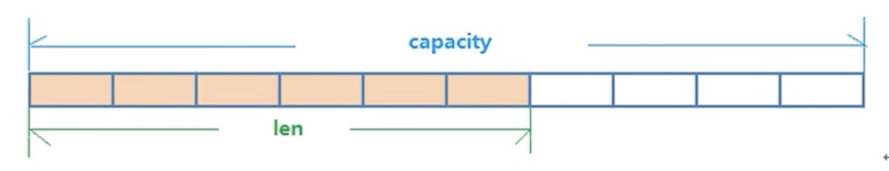
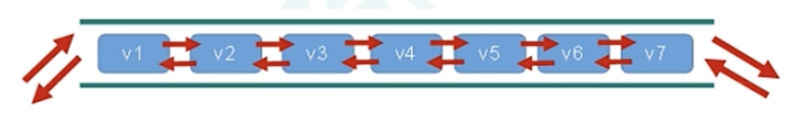
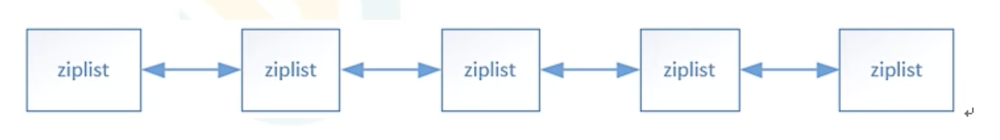

# redis

单线程+多路IO复用


## Redis键(key)常用操作

```
keys *		# 查看所有key
exists key		# 判断key是否存在
type key			# 查看key的类型
del key				# 删除指定key的数据
unlink key 		# 根据value选择非租塞删除，仅将keys冲keyspace元数据中删除，真正的删除会在后续异步操作
expire key 10		# 给指定的key设置过期时间为10s
ttl key 				# 查看key还有多少秒过去，-1：用不过期，-2:已过期

select 					# 命令切换数据库
dbsize					# 查看当前数据库key的数量
flushdb					# 清空当前库
flushall				# 通杀全部库
```

## Value常用五大数据类型

* 字符串（String）
* 列表（List）
* 集合（Set）
* 哈希（Hash）
* 有序集合（Zset）

### 字符串（String）

####简介

string是redis最基本的类型，你可以理解成与Memcache一摸一样的类型，一个key对应一个value

string类型是**二进制安全的**。意味着redis的string可以包含任何数据。比如jpg图片或序列化对象

string类型是redis最基本的数据类型，一个redis中字符串values最多可以是512M

#### 常用命令

```
set <key> <value> 	# 添加键值对
set key value [EX seconds|PX millisconds|KEEPTTL] [NX|XX]
get <key>							# 取得key的值
append <key> <value>	# 将给定的value追加到原值的末尾
strlen <key>					# 获得值的长度
setnx <key> <value>		# 只有在key不存在时，设置key的值

incr <key>		# 将key中存储的数字值增1，只有对数字值操作，如果为空，新增为1
decr <key>		# 将key中存储的数字值减1，只有对数字值操作，如果为空，新增为-1
incrby/decrby <key> <步长>	# 将key中存储的值加减步长

mset <key1><value1> <key2><value2> ... # 同时设置一个或多个k-v对
mget <key1><key2>... # 同时获取一个或多个v
msetnx <key1><value1> <key2><value2> ... # 同时设置一个或多个k-v对,只有在key不存在时
# 原子性，有一个失败，都失败

getrange <key> <起始位置><结束位置>		# 获取值的范围 包头包尾
#Localhost:0>getrange k2 0 1
#"v2"
#Localhost:0>get k2
#"v200"
#Localhost:0>
setrange <key><起始位置><value>			# 在指定的范围中，设置值

setex <key><过期时间><value>	# 设置键值的同时，设置过期时间，单位秒 # setex k2 10 v2
getset <key> <value>				# 以旧换新 设置新的同时，获取旧值
```

原子性

不会被线程调度机制打断的操作

 `incr <key>`时，具有原子性

#### 数据结构

string的数据结构为简单动态字符串(Simple Dynamic String，简写SDS)，是可以修改的字符串，内部结构类似java中的ArrayList，采用预分配冗余空间的方式来减少内存的频繁分配



内部预分配的空间capacity一般要高于实际字符串长度len，当字符串长度<1M时，扩容都是加倍现有空间，当超过1M时，一次只会多扩1M空间，不一定是2倍。最大512M


### 列表（List）

#### 简介

单键多值

redis列表是简单的字符串列表，按照插入顺序排序。可以添加一个元素到列头或列尾

它的底层实际是个双向链表，对两端的操作性能很高，通过索引下标的操作中间的节点性能会比较差



#### 常用命令

```
lpush/rpush <key><value1><value2><value3>... # 从左边/右边插入一个或多个值
lpop/rpop <key>		# 从左边/右边吐出一个值。值在键在，值光键亡

rpoplpush <key1><key2> 从<key1>列表右边吐出一个值，插入到<key2>列表左边

lrange <key><start><stop>		# 按照索引下标获取元素(从左到右) 0：左第一个 -1:右第一个

lindex <key><index>		# 按照索引下标获取元素
llen <key>		# 获得列表长度

linsert <key> before/after <value><newvalue>	#在<value>前或后插入<newvalue>
lrem <key><n><value> 		# 从左边删除n个value
lset <key><index><value> 	# 将列表key下标为index的值替换成value
```


#### 数据结构

list的底层数据结构是一个快速链表 quickList

当元素比较少时，会分配一块**连续的内存**空间，这个结构是ziplist，即压缩列表，将所有元素紧挨在一起存储

当元素多时，把多个ziplist连接起来，变成quicklist



链表需要额外存储指针，所以占用空间较大，比如双向链表需要两个指针

redis的quicklist，既满足快速增删，又不会有太多冗余


### 集合（Set）

#### 简介

无序不可重复的string元素

#### 常用命令

```
sadd <key><value1><value2> ... # 添加元素到集合
smembers <key>			# 取出集合所有元素
sismember <key><value> 	# 判断集合<key>是否含有<value>
scard <key>		# 返回集合元素个数
srem <key> <value1><value2>...  # 删除集合中的某个元素
spop <key>		# 随机从该集合中吐出并删除一个值
srandmember <key><n> # 随机从该集合中取出n个值，不会从集合中删除
smove <k1><k2> value # 把集合中的一个值，从k1移动到k2
sinter <k1><k2> 	# 返回两个集合的交集
sunion <k1><k2> 	# 返回两个集合的并集
sdiff <k1><k2> 		# 返回两个集合的差集，在k1不在k2

```

#### 数据结构

set数据结构是dict字典，字典是哈希表实现的


### 哈希（Hash）

#### 简介

redis hash是一个键值对集合，类似java中的map

redis hash是一个string类型的field和value的映射表，hash特别适合用于存储对象，如key=user1，value={id=1,name=tom,age=20}，Map<Sting,Object>

#### 常用命令

```
hset <key><field><value> 	# 给指定key集合中的field键赋值value
hget <key><field>				# 获取key中field的值
hmset <key><field1><value1><field2><value2>...		# 批量设置
hexists <key><field1> # 查看key中field1是否存在
hkeys <key>						# 列出key中的所有field
hvals <key>						# 列出key中的所有value

hincrby <key><field><increment>		# 为key中的field的值，增加increment
hsetnx <key><field><value>				# 给指定key集合中的field键赋值value,仅当field不存在时
```

#### 数据结构

当数据少时，用ziplist，当数据多时，用hashTable


### 有序集合（Zset）sorted set

#### 简介

有序不可重复的集合，序列是按每个元素所关联的分数进行排序

#### 常用命令

```
zadd <key><score1><value1><score2><value2>... 	# 将一个或多个member元素及score值加入到有序key中
zrange <key><start><end> [withscores]					# 取出 key中角标从start到end的值，withscores带上分数，得分从小到大排序
zrangebyscore k1 100 350 withscores			# 取出k1中 得分在[100,350]之间的value，withscores带上分数，得分从小到大排序
zrevrangebyscore k1 350 100 withscores		# 取出k1中 得分在[100,350]之间的value，withscores带上分数，得分从大到小排序


zincrby <key><increment><value>			# 为key中元素值为value的得分加上increment
zrem <key><value>										# 删除key下的value
zcount <key><min><max>							# 统计该集合，分数区间[min,max]内的元素个数
zrank <key><value>									# 返回该值在集合中的排名，从0开始
```

#### 数据结构

存储方式类似hash方式，一个key，value中是多个键值对，但是排序会根据得分

采用跳跃表，能更高效的查找数据，但具体如何跳跃？


## 新数据类型

### BitMaps

#### 简介

1. 其实本身不是一种数据类型，实际上就只是string，但可以对**位**进行操作
2. bitMaps单独提供一套命令，和字符串不太相同，可以把BitMaps想象成一个以位为单位的数组，数组的每个单元只能存储0或1，数组的下标在BitMaps中叫偏移量

#### 命令

```

```


### HyperLogLog

#### 简介

#### 命令

### Geospatial

#### 简介

#### 命令


## Redis的发布和订阅

* 什么是发布和订阅

  redis发布订阅（pub/sub）是一种消息通信模式：发送者（pub）发送消息，订阅者（sub）接收消息

  redis客户端可以订阅任意数量的频道

* 执行

  ```
  # 打开一个命令行客户端
  subcribe channel1		# 订阅频道channel1
  
  # 代开另一个客户端
  publish channel1 aaa	# 向频道channel1推送消息aaa
  ```

  