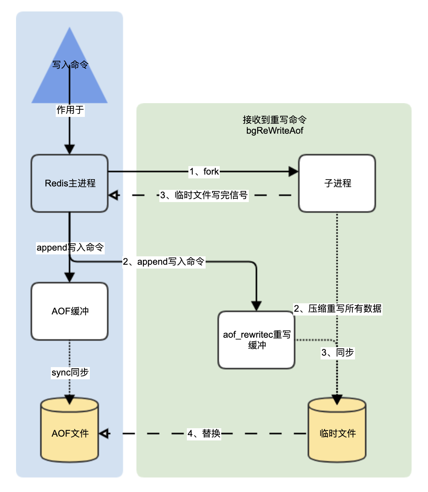

# redis

单线程+多路IO复用


## Redis键(key)常用操作

```
keys *		# 查看所有key
exists key		# 判断key是否存在
type key			# 查看key的类型
del key				# 删除指定key的数据
unlink key 		# 根据value选择非租塞删除，仅将keys冲keyspace元数据中删除，真正的删除会在后续异步操作
expire key 10		# 给指定的key设置过期时间为10s
ttl key 				# 查看key还有多少秒过去，-1：用不过期，-2:已过期

select 					# 命令切换数据库
dbsize					# 查看当前数据库key的数量
flushdb					# 清空当前库
flushall				# 通杀全部库
```

## Value常用几大数据类型

* 字符串（String）
* 列表（List）
* 集合（Set）
* 哈希（Hash）
* 有序集合（Zset）
* BitMaps（位map）
* HyperLogLog
* GeoSpatial

### 字符串（String）

####简介

string是redis最基本的类型，你可以理解成与Memcache一摸一样的类型，一个key对应一个value

string类型是**二进制安全的**。意味着redis的string可以包含任何数据。比如jpg图片或序列化对象

string类型是redis最基本的数据类型，一个redis中字符串values最多可以是512M

#### 常用命令

```
set <key> <value> 	# 添加键值对
set key value [EX seconds|PX millisconds|KEEPTTL] [NX|XX]
get <key>							# 取得key的值
append <key> <value>	# 将给定的value追加到原值的末尾
strlen <key>					# 获得值的长度
setnx <key> <value>		# 只有在key不存在时，设置key的值

incr <key>		# 将key中存储的数字值增1，只有对数字值操作，如果为空，新增为1
decr <key>		# 将key中存储的数字值减1，只有对数字值操作，如果为空，新增为-1
incrby/decrby <key> <步长>	# 将key中存储的值加减步长

mset <key1><value1> <key2><value2> ... # 同时设置一个或多个k-v对
mget <key1><key2>... # 同时获取一个或多个v
msetnx <key1><value1> <key2><value2> ... # 同时设置一个或多个k-v对,只有在key不存在时
# 原子性，有一个失败，都失败

getrange <key> <起始位置><结束位置>		# 获取值的范围 包头包尾
#Localhost:0>getrange k2 0 1
#"v2"
#Localhost:0>get k2
#"v200"
#Localhost:0>
setrange <key><起始位置><value>			# 在指定的范围中，设置值

setex <key><过期时间><value>	# 设置键值的同时，设置过期时间，单位秒 # setex k2 10 v2
getset <key> <value>				# 以旧换新 设置新的同时，获取旧值
```

原子性

不会被线程调度机制打断的操作

 `incr <key>`时，具有原子性

#### 数据结构

string的数据结构为简单动态字符串(Simple Dynamic String，简写SDS)，是可以修改的字符串，内部结构类似java中的ArrayList，采用预分配冗余空间的方式来减少内存的频繁分配


内部预分配的空间capacity一般要高于实际字符串长度len，当字符串长度<1M时，扩容都是加倍现有空间，当超过1M时，一次只会多扩1M空间，不一定是2倍。最大512M


### 列表（List）

#### 简介

单键多值

redis列表是简单的字符串列表，按照插入顺序排序。可以添加一个元素到列头或列尾

它的底层实际是个双向链表，对两端的操作性能很高，通过索引下标的操作中间的节点性能会比较差


#### 常用命令

```
lpush/rpush <key><value1><value2><value3>... # 从左边/右边插入一个或多个值
lpop/rpop <key>		# 从左边/右边吐出一个值。值在键在，值光键亡

rpoplpush <key1><key2> 从<key1>列表右边吐出一个值，插入到<key2>列表左边

lrange <key><start><stop>		# 按照索引下标获取元素(从左到右) 0：左第一个 -1:右第一个 -2:右第二...

lindex <key><index>		# 按照索引下标获取元素
llen <key>		# 获得列表长度

linsert <key> before/after <value><newvalue>	#在<value>前或后插入<newvalue>
lrem <key><n><value> 		# 从左边删除n个value
lset <key><index><value> 	# 将列表key下标为index的值替换成value
```


#### 数据结构

list的底层数据结构是一个快速链表 quickList

当元素比较少时，会分配一块**连续的内存**空间，这个结构是ziplist，即压缩列表，将所有元素紧挨在一起存储

当元素多时，把多个ziplist连接起来，变成quicklist


链表需要额外存储指针，所以占用空间较大，比如双向链表需要两个指针

redis的quicklist，既满足快速增删，又不会有太多冗余


### 集合（Set）

#### 简介

无序不可重复的string元素

#### 常用命令

```
sadd <key><value1><value2> ... # 添加元素到集合
smembers <key>			# 取出集合所有元素
sismember <key><value> 	# 判断集合<key>是否含有<value>
scard <key>		# 返回集合元素个数
srem <key> <value1><value2>...  # 删除集合中的某个元素
spop <key>		# 随机从该集合中吐出并删除一个值
srandmember <key><n> # 随机从该集合中取出n个值，不会从集合中删除
smove <k1><k2> value # 把集合中的一个值，从k1移动到k2
sinter <k1><k2> 	# 返回两个集合的交集
sunion <k1><k2> 	# 返回两个集合的并集
sdiff <k1><k2> 		# 返回两个集合的差集，在k1不在k2

```

#### 数据结构

set数据结构是dict字典，字典是哈希表实现的


### 哈希（Hash）

#### 简介

redis hash是一个键值对集合，类似java中的map

redis hash是一个string类型的field和value的映射表，hash特别适合用于存储对象，如key=user1，value={id=1,name=tom,age=20}，Map<Sting,Object>

#### 常用命令

```
hset <key><field><value> 	# 给指定key集合中的field键赋值value
hget <key><field>				# 获取key中field的值
hmset <key><field1><value1><field2><value2>...		# 批量设置
hexists <key><field1> # 查看key中field1是否存在
hkeys <key>						# 列出key中的所有field
hvals <key>						# 列出key中的所有value

hincrby <key><field><increment>		# 为key中的field的值，增加increment
hsetnx <key><field><value>				# 给指定key集合中的field键赋值value,仅当field不存在时
```

#### 数据结构

当数据少时，用ziplist，当数据多时，用hashTable


### 有序集合（Zset）sorted set

#### 简介

有序不可重复的集合，序列是按每个元素所关联的分数进行排序

#### 常用命令

```
zadd <key><score1><value1><score2><value2>... 	# 将一个或多个member元素及score值加入到有序key中
zrange <key><start><end> [withscores]					# 取出 key中角标从start到end的值，withscores带上分数，得分从小到大排序
zrangebyscore k1 100 350 withscores			# 取出k1中 得分在[100,350]之间的value，withscores带上分数，得分从小到大排序
zrevrangebyscore k1 350 100 withscores		# 取出k1中 得分在[100,350]之间的value，withscores带上分数，得分从大到小排序


zincrby <key><increment><value>			# 为key中元素值为value的得分加上increment
zrem <key><value>										# 删除key下的value
zcount <key><min><max>							# 统计该集合，分数区间[min,max]内的元素个数
zrank <key><value>									# 返回该值在集合中的排名，从0开始
```

#### 数据结构

存储方式类似hash方式，一个key，value中是多个键值对，但是排序会根据得分

采用跳跃表，能更高效的查找数据，但具体如何跳跃？


### BitMaps(位map)

#### 简介

1. 其实本身不是一种数据类型，实际上就只是string，但可以对**位**进行操作
2. bitMaps单独提供一套命令，和字符串不太相同，可以把BitMaps想象成一个以位为单位的数组，数组的每个单元只能存储0或1，数组的下标在BitMaps中叫偏移量

#### 命令

```
setbit <key><offset><value>		# 设置一个键为key，值为value，偏移量为offset的bitMaps
setbit k1 0 1		# 设置k1位列表的第0位为1
setbit k1 1 1
setbit k1 6 1
setbit k1 11 1
setbit k1 15 1
setbit k1 19 1
```

每个独立用户是否访问过网站存放在Bitmaps中， 将访问的用户记做1， 没有访问的用户记做0， 用偏移量作为用户的id

设置键的第offset个位的值（从0算起） ， 假设现在有20个用户，userid=1， 6， 11， 15， 19的用户对网站进行了访问， 那么当前Bitmaps初始化结果如图


```
getbit k1 0			# 获取k1列表的第0位

bitcount <key><start><end>		# 统计key列表中从[start,end]个字节(8位)共有多少是1

setbit操作的是位bit
bitcount统计的是字节byte(8bit)

bitop and/or/not/xor <destkey> [k1,k2,...]
# bitop是一个复合操作，将k1、k2等多个位map的交集(and)/并集(or)/非(or)/异或(xor)的结果保存到destkey中

setbit k2 1 1
setbit k2 2 1
setbit k2 5 1
setbit k2 9 1

setbit k3 0 1
setbit k3 1 1
setbit k3 4 1
setbit k3 9 1

bitop and k23 k2 k3	# 去k2和k3的并集放入k23
```

#### bitMaps对比set

假设网站有1亿用户， 每天独立访问的用户有5000万， 如果每天用集合类型和Bitmaps分别存储活跃用户可以得到表

| 数据类型 | 每个用户id占用空间 | 需要存储的用户量 | 全部内存量                                 |
| -------- | ------------------ | ---------------- | ------------------------------------------ |
| set      | 64位(8字节)        | 50 000 000       | 64bit(8byte)*50 000 000=400,000,000B=400M  |
| BitMaps  | 1位                | 100 000 000      | 1((1/8)byte)*100 000 000=12 500 000B=12.5M |

很明显， 这种情况下使用Bitmaps能节省很多的内存空间， 尤其是随着时间推移节省的内存还是非常可观的

| 数据类型 | 一天  | 一个月 | 一年 |
| -------- | ----- | ------ | ---- |
| set      | 400M  | 12G    | 144G |
| BitMaps  | 12.5M | 375M   | 4.5G |

但如果每天访问的用户数很少，例如只有10万个，这时bitmaps就不太合适，因为大部分都是0，尔set只需存储相应的活跃用户数

| 数据类型 | 每个用户id占用空间 | 需要存储的用户量 | 全部内存量                                 |
| -------- | ------------------ | ---------------- | ------------------------------------------ |
| set      | 64位(8字节)        | 100 000          | 64bit(8byte)*100 000=800 000B=800k         |
| BitMaps  | 1位                | 100 000 000      | 1((1/8)byte)*100 000 000=12 500 000B=12.5M |


### HyperLogLog

#### 简介

什么是基数?

比如数据集 {1, 3, 5, 7, 5, 7, 8}， 那么这个数据集的基数集为 {1, 3, 5 ,7, 8}, 基数(不重复元素)为5。 基数估计就是在误差可接受的范围内，快速计算基数

为了统计不重复数据，解决基数问题，有两种方案，1）mysql中进行distinct count；2）在redis中使用hash、set、bitmaps等解决，数据精准但空间越来越大

所以退出HyperLogLog，降低精度平衡空间

HyperLogLog 的优点是，在输入元素的数量或者体积非常非常大时，计算基数所需的空间总是固定的、并且是很小的

HyperLogLog 只会根据输入元素来计算基数，而不会储存输入元素本身，所以 HyperLogLog 不能像集合那样，返回输入的各个元素

#### 命令

```
pfadd <key><element>		# 返回key 中，基数是否发生变化 1:变 0:不变
pfadd k1 a	# 1
pfadd k1 b	# 1
pfadd k1 a	# 0

pfcount <key>		# 计算key的基数
pfadd k1	# 2

pfmerge <destkey> <sourcekey1> <sourcekey2># 将sourcekey1和sourcekey2得基数汇聚到destkey
pfmerge k1 k2 k3
```


### GeoSpatial

#### 简介

Geographic，地理信息的缩写。地理信息的缩写。该类型，就是元素的2维坐标，在地图上就是经纬度。redis基于该类型，提供了经纬度设置，查询，范围查询，距离查询，经纬度Hash等常见操作

两极无法直接添加，一般会下载城市数据，直接通过 Java 程序一次性导入

有效的经度从 -180 度到 180 度。有效的纬度从 -85.05112878 度到 85.05112878 度。

当坐标位置超出指定范围时，该命令将会返回一个错误。

已经添加的数据，是无法再次往里面添加的。

#### 命令

```
geoadd <key> <longitude><latitude><member>[longitude latitude member...]	# 添加地理位置（经度、纬度、名称）
geoadd k1 106.63 26.64 guiyang 114.05 22.52 shenzhen

geopos  <key><member> [member...]  # 获得指定地区的坐标值
geopos k1 guiyang

geodist<key><member1><member2>  [m|km|ft|mi ]  # 获取两个位置之间的直线距离
geodist k1 guiyang shenzhen	# 默认单位米

georadius<key><longitude><latitude>radius  m|km|ft|mi   #以给定的经纬度为中心，找出某一半径内的元素 精度 维度 距离 单位
georadius k1 106.63 26.64 1000 km
```


## Redis的发布和订阅

* 什么是发布和订阅

  redis发布订阅（pub/sub）是一种消息通信模式：发送者（pub）发送消息，订阅者（sub）接收消息

  redis客户端可以订阅任意数量的频道

* 执行

  ```
  # 打开一个命令行客户端
  subcribe channel1		# 订阅频道channel1
  
  # 代开另一个客户端
  publish channel1 aaa	# 向频道channel1推送消息aaa
  ```
  
## Redis 事务
Redis事务是一个单独的隔离操作：事务中的所有命令都会序列化、按顺序地执行。事务在执行的过程中，不会被其他客户端发送来的命令请求所打断。
Redis事务的主要作用就是串联多个命令防止别的命令插队

### Multi、Exec、discard
* Multi 开始组队 类似开启事务
* Exec 执行 类似提交
* discard 撤销组队 类似回滚


1. 当组队时发生错误（，执行时，整改队列都失败
    比如组队时`> set k2`，
2. 当执行提交时发生错误，谁错谁失败，谁对谁成功
    比如，拿字符串自增，组队时显示正常，执行时谁错谁失败

### 事务冲突


* 解决事务冲突：
1. 悲观锁：悲观的认为冲突一定会产生，每次操作前都加锁，操作后放锁，效率较低
2. 乐观锁：乐观的认为冲突不一定会产生，操作时，添加版本字段，来判断是否需要重写读取

* 乐观锁实现
    * 在执行multi之前，先执行watch key1 [key2],可以监视一个(或多个) key ，如果在事务执行之前这个(或这些) key 被其他命令所改动，那么事务将被打断
    * unwatch取消WATCH命令对所有 key 的监视。
        如果在执行 WATCH 命令之后，EXEC 命令或DISCARD 命令先被执行了的话，那么就不需要再执行UNWATCH了
        
        
## 持久化
redis提供2个不同形式的持久化方式
* RDB（Redis DataBase）
* AOF（Append Only File）

### RDB
#### 做什么
在指定的 **时间间隔** 内将内存中的 **数据集快照** 写入磁盘，Snapshot快照，恢复时将快照文件直接读到内存

#### RDB持久化过程
1. 每一定时间间隔，redis 单独创建一个子进程fork，子进程的所有数据和原进程一致。
2. fork子进程会先将 **数据快照**写入到一个临时文件中
3. 写入结束后，再用临时文件替换上次持久化好的文件

    
为什么要这么做：
1. 整改过程中，原进程无任何IO操作，确保极高的性能
2. 写完整的数据后，再进行覆盖，避免突然断掉出现中间情况

#### 配置
RDB在redis.conf配置文件中相关配置
```
dbfilename  dump.rdb    # 持久化文件名
dir ./                  # 存储位置
stop-writes-on-bgsave-error yes     # 当redis无法写入磁盘时，停止redis的写操作
    
rdbcompression yes/no   # 是否对快照进行压缩存储。如果是的话，redis会采用LZF算法进行压缩
rdbchecksum yes         # 是否进行完整性检测，redis使用CRC64算法来进行数据校验
    
save s c                # 开启自动RDB，s秒内，若数据修改次数超过或等于c次，就进行持久化
```

一些命令
```
> config set save "s c"  # 开启自动RDB，s秒内，若数据修改次数超过或等于c次，就进行持久化
> config set save ""    # 关闭自动RDB
> save  # 手动同步保存 将当前redis所有数据快照立刻保存到dump.rdb，会有阻塞
> bgsave    # 手动异步保存 后台异步进行 不阻塞
> lastsave    # 获取最后一次成功写入快照时间
> flushall    # 会清空dump.rdb文件
```


* rdb的备份
当redis启动时，会读取dump.rdb文件到内存中


### AOF

#### 做什么
以日志的形式来记录每一个**写操作**，将redis执行过的所有写指令记录下来，只允许追加文件但不可以改写文件，redis启动时会读取该文件，将数据恢复

#### AOF持久化过程
1. 客户端的请求写命令会被append到AOF缓冲区内；
2. AOF缓冲区根据AOF持久化策略`[always\everysec\no]`将操作同步到磁盘的AOF文件
3. AOF文件大小超过重写策略或手动重写时，AOF文件被重写，对AOF文件进行压缩
4. redis重启时，会加载AOF文件中的操作，达到数据恢复的目的
    

#### 配置、备份
* AOF默认不开启
```
appendonly on                       # AOF是否开启，默认不开启
appendfilename "appendonly.aof"     # AOF文件名
# 存储路径与RDB的dump.rdb文件相同

# AOF同步频率
appendsync always/everysec/no   
# always 始终同步，每次Redis的写入都会到缓冲，立刻同步到文件；性能较差但数据完整性比较好
# everysec 每秒同步，每秒同步一次，若宕机，本秒数据可能丢失
# no redis不主动进行同步，把同步时机交给操作系统
```
* AOF 文件修复
若AOF文件`appendonly.aof`损坏，可用`redis-check-aof`进行修复:
    ```
    /usr/local/bin/redis-check-aof --fix appendonly.aof 
    ```


#### 重写
将多条命令转换成一条命令，结果一样，但却节约了空间
```
> bgrewriteaof  # 重写命令

# 重写相关配置
auto-aof-rewrite-percentage:100%     # 重写触发基准，AOF文件是上一次重写后的1倍（默认）
auto-aof-rewrite-min-size:64M       # 重写触发基准，AOF文件至少64M（默认）
# 如：文件达到70MB开始重写，降到50MB，下次什么时候开始重写？
# 答：100M

no-appendfsync-on-rewrite yes/no   # 在重写时，不同步aof_buf到appendonly.aof yes/no
# yes 重写时不同步，添加命令只会到AOF缓冲aof_buf，不会同步到appendonly.aof
# no 重写时同步，添加命令会阻塞，等待重写
```

* 重写流程
    0、判断当前是否有`bgsave`或`bgrewriteaof`在运行，如果有，就等到结束后再继续执行
    1、主进程fork出子进程进行重写，保证主进程不会阻塞，与rdb相似
    2、子进程重写压缩redis内存中数据到临时文件，此时的写入命令，会被同时append到`AOF缓冲区`和`AOF_REWRIEC重写缓存区`
    3、临时文件重写完成通知主进程，主进程将`重写缓存区`append到已经完成的临时文件
    4、用重写好并append`重写缓存区`数据的临时文件，替换原AOF文件
    

#### 优劣势
* 备份进制稳健，丢失数据概率低
* 可读的日志文本，通过操作AOF文件，可处理误操作

### RDB与AOF优劣势
* 数据完整行：RDB<AOF RDB可能存在未存储到磁盘的数据
* 恢复速度：RDB>AOF RDB直接回复
* 磁盘占用：RDB<AOF AOF把写命令都记录下来
* 内存消耗：RDB>AOF RDB需要两倍内存

两者同时存在时：优先权 AOF>RDB，因为AOF完整性更好

使用建议：
* 两个都启用
* 对于数据完整性不敏感，可单独用RDB
* 不建议单独用AOF，因为可能会出现Bug
* 因为RDB文件只用作后备用途，建议只在Slave上持久化RDB文件，而且只要15分钟备份一次就够了，只保留save 900 1这条规则
* 只要硬盘许可，应该尽量减少AOF rewrite的频率，AOF重写的基础大小默认值64M太小了，可以设到5G以上
* 默认超过原大小100%大小时重写可以改到适当的数值


## 主从复制
* 能干嘛
    * 读写分离，性能扩展
    * 荣宅快速恢复
    
    
* 怎么玩
    * 一份redis.conf文件，关闭AOF
    * 多分redis_xxx.conf文件，文件中
        ```bash
        include /myredis/redis.conf # 导入同一份redis.conf
        pidfile /var/run/redis_xxx.pid  # 定义自己的pid文件
        prot xxx    # 定义自己的端口
        dbfilename dumpxxx.rdb  # 定义自己的rdb文件
        ```
    * 分别启动多台
        ```
        > redis-server redis_xxx.conf
        > ...
        ```
    * 查看主从复制详细
        ```
        > redis-cli -p xxx  # 连接xxxredis
        > info replication
        ```
    * 分配主从服务器，
        ```
        > slaveof master_ip master_port     # 将该redis归从于master
        ```
* 相关属性
    * `slave`节点只能读，不能写
    * 一主二扑：`master`节点挂掉，`slave`默认还是只认他
    * 薪火相传：`slave`子节点依然可以收子节点，相关属性一样
    * 反客为主：当`master`挂掉后，在某子节点上执行`slaveof no one`，可将其变为主节点
* 哨兵模式(sentinel)
    * 反客为主自动版
    * 怎么玩
        * 新建`sentinel.conf`文件，写入以下内容
            ```
            sentinel monitor myMaster <master_ip> <master_port> 2
            # myMaster为监视对象起的名称，2 代表至少需要两个Sentinel节点认为主节点主观下线，才可判定主节点为客观下线
            ```
        * 启动
            ```
            > /usr/local/bin/redis-sentinel sentinel.conf
            ```

### 主从复制原理
1. slave启动成功连接到master后，会发送一个sync命令
2. master接收到命令，启动后台的存盘进程(RDB)，同时收集所有接收到的用于修改数据集的命令，后台进程执行完毕后，将整改数据文件发送给slave，完成一次完全同步
3. slave接收到文件，加载进内存


## Redis集群
多个主从复制和在一起
* 怎么玩
    * 一份redis.conf文件，关闭AOF
    * 多分redis_xxx.conf文件，文件中
        ```
        include /myredis/redis.conf # 导入同一份redis.conf
        pidfile /var/run/redis_xxx.pid  # 定义自己的pid文件
        prot xxx    # 定义自己的端口
        dbfilename dumpxxx.rdb  # 定义自己的rdb文件
        cluster-enabled yes # 开启集群模式
        cluster-config-file nodes-xxx.conf # 集群节点配置文件名
        cluster-node-timeout 15000 # 节点失联时间
        ```
    * 分别启动各个节点
    * 创建集群
        ```
        /opt/redis-6.2.1/src/redis-cli --cluster create --cluster-replicas 1 nodeIp1:6379 nodeIp2:6379 ...
        # 其中的1表示以最简单的方式组合集群
        # 创建集群后，共有16384个插槽
        ```
    * 连接集群
        ```
        > redis-cli -p 6379 # 连接单机
        > redis-cli -c -p 6379 # 连接集群
        > cluster nodes # 查看集群信息，一个集群中，至少有3个主节点
        ```
创建集群后，共有16384个插槽，集群中各个主节点，平分这16384个插槽

插入一个数据时，集群使用一个公式来计算键key属于哪个槽，放到对应的节点上
一次设置多个数据时，会报错，因为不同的key在位于不同的节点，需要进行分组，才能存放
```
mset k1{cust} v1 k2{cust} v2 k3{cust} v3
```


```
192.168.3.215:6379> cluster keyslot cust  # 计算cust这组在哪个插槽
192.168.3.215:6379> cluster countkeysinslot 4847 # 查看4847这个插槽上的数据量，必须在对应的节点上执行才有效
192.168.3.215:6379> cluster getkeysinslot 4847 10 # 获取在4847插槽上的key，必须在对应的节点上执行
```

* 故障恢复
    * 主节点挂掉后，他的从节点顶上，成为主节点
    * 主从都挂掉，看`cluster-require-full-coverage yes`，整个集群都挂掉，`no`该节点对应的插槽不能使用