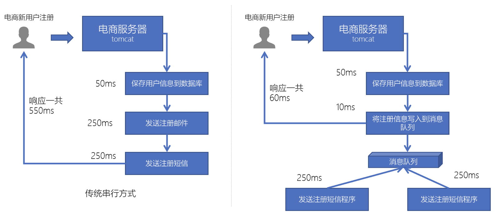
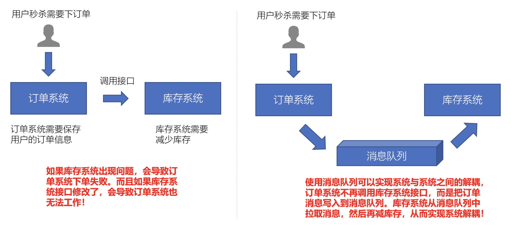
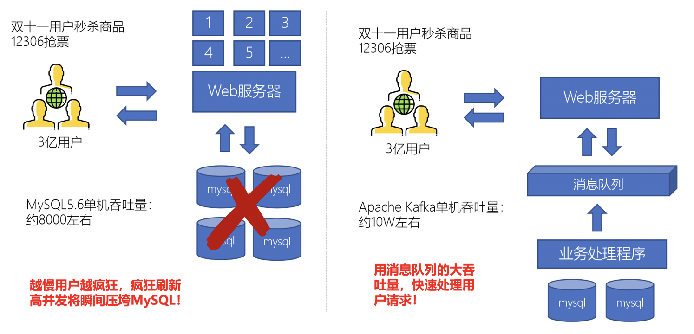
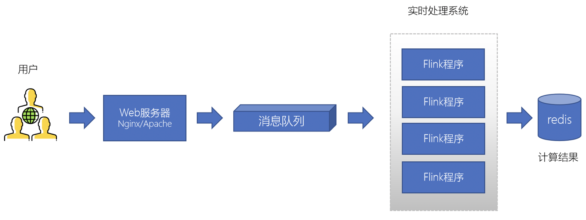
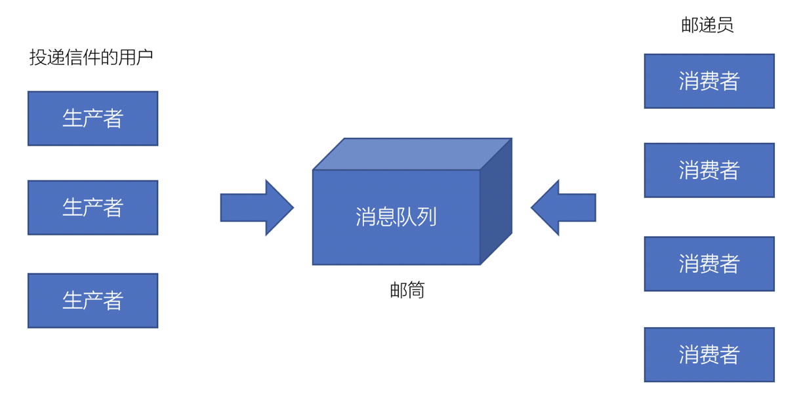
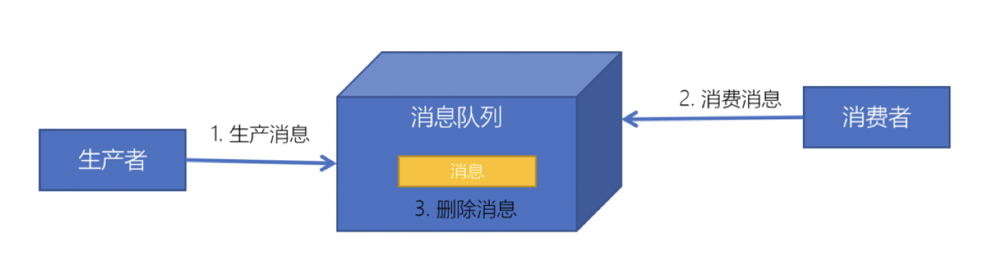
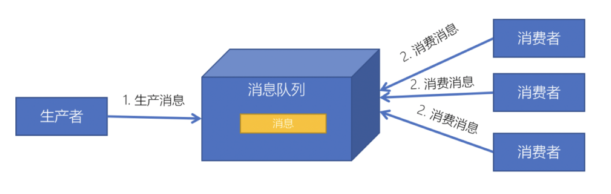

# 1 简介
## 消息队列
## 消息中间件
* 消息队列中间件就是用来存储消息的软件（组件），例如：为了分析网站的用户行为，我们需要记录用户的访问日志。这些一条条的日志，可以看成是一条条的消息，我们可以将它们保存到消息队列中。将来有一些应用程序需要处理这些日志，就可以随时将这些消息取出来处理
* 目前主流消息中间件：kafka、rabbitMQ、ActiveMQ、RocketMQ、ZeroMQ
## 应用场景
* 异步处理
    * 可以将一些比较耗时的操作放在其他系统中，通过消息队列将需要进行处理的消息进行存储，其他系统可以消费消息队列中的数据
    * 比较常见的：发送短信验证码、发送邮件
        
* 系统解耦
    * 原先一个微服务是通过接口（HTTP）调用另一个微服务，这时候耦合很严重，只要接口发生变化就会导致系统不可用
    * 使用消息队列可以将系统进行解耦合，现在第一个微服务可以将消息放入到消息队列中，另一个微服务可以从消息队列中把消息取出来进行处理。进行系统解耦
         
* 流量消峰
    * 因为消息队列是低延迟、高可靠、高吞吐的，可以应对大量并发，相当于取号排队
        
* 日志处理
    * 可以使用消息队列作为临时存储，或者一种通信管道
        
        
## 交互模型
### 请求响应模型
* `http`请求响应，如`http`前后端交互
* 数据库请求响应，如`jdbc`程序与数据库交互
### 消息模型
#### 生产者、消费者模式


* 生产者负责将消息生产到MQ中
* 消费者负责从MQ中获取消息
* 生产者和消费者是解耦的，可能是生产者一个程序、消费者是另外一个程序
#### 消息队列模式
* 点对点：一个消费者消费一个消息
    
    * 每个消息只有一个接收者（Consumer）（即一旦被消费，消息就不再在消息队列）
    * 发送者和接收者间没有依赖性，发送者发送消息之后，不管有没有接收者在运行，都不会影响到发送者下次发送消息
    * 接收者在成功接收消息之后需向队列应答成功，以便消息队列删除当前接收的消息
* 发布订阅：多个消费者可以消费一个消息
     
     * 每个消息可以有多个订阅者，被多个消费者消费
     * 发布者和订阅者之间有时间上的依赖性。针对某个主题（Topic）的订阅者，它必须创建一个订阅者之后，才能消费发布者的消息
     * 为了消费消息，订阅者需要提前订阅该角色主题，并保持在线运行

# zookeeper
提供分布式协同服务
```
# 修改conf/zoo_sample.cfg文件名为zoo.cfg，并进行相关配置
bin/zkServer.sh start #启动
bin/zkCli.sh -server 127.0.0.1:2181 # 连接到zk服务
连接到服务后
> ls /  # 查看更目录节点
> create /zk_test my_data   # 创建节点/zk_test
> get /zk_test # 获取/zk_test节点的数据
```
# kafka
apache kafka是一个分布式流平台，一个分布式的流平台应该包含3点关键的能力
* **发布和订阅** 流数据流，类似于消息队列或者是企业消息传递系统
* 以容错的持久化方式 **存储** 数据流
    * 和为容错的持久化方式？
* **处理** 数据流
发布与订阅、存储、处理

[官方快速启动案例](https://kafka.apache.org/quickstart)
```
# 主题类似于文件系统中的文件夹，事件是该文件夹中的文件
# 创建一个主题 quickstart-events
./kafka-topics.sh --create --topic quickstart-events --bootstrap-server localhost:9092
# 查看主题
./kafka-topics.sh --describe --topic quickstart-events --bootstrap-server localhost:9092

# 在主题中写下一些事件
# kafka客户端通过网络与kafka brokers通信，一旦收到事件，brokers将以持久和容错的方式存储事件
./kafka-console-producer.sh --topic quickstart-events --bootstrap-server localhost:9092
> 这是第一个事件

# 接收事件
./kafka-console-consumer.sh --topic quickstart-events --from-beginning --bootstrap-server localhost:9092
```

