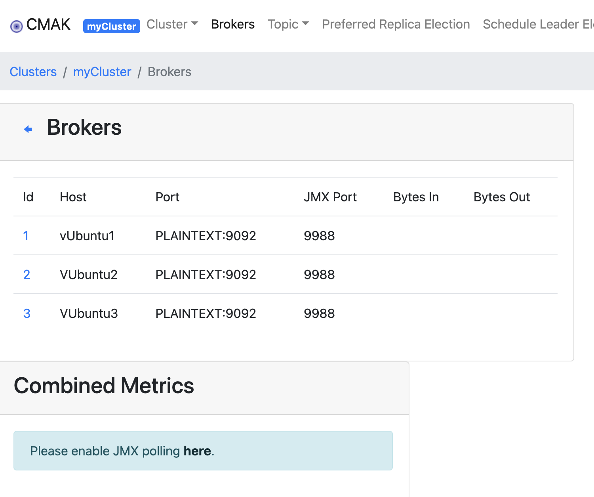
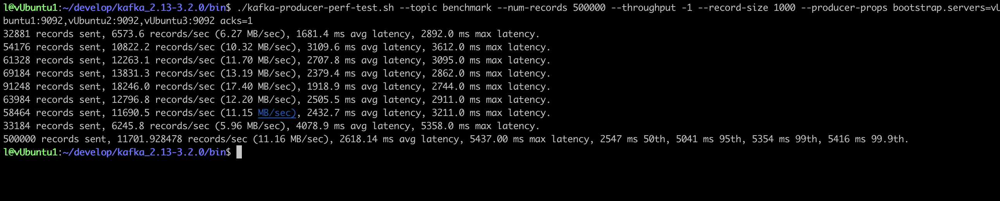
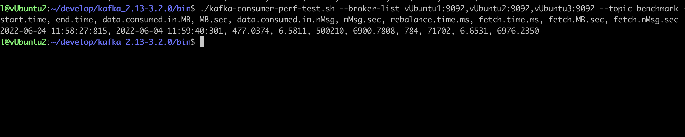
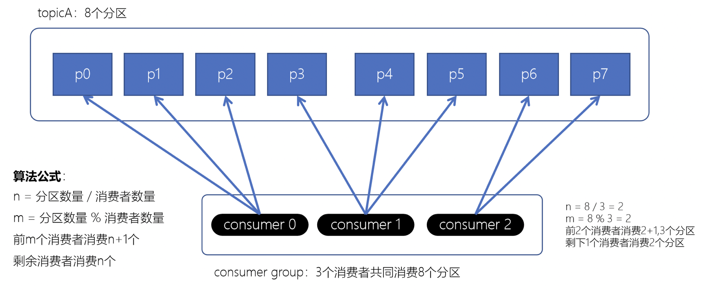
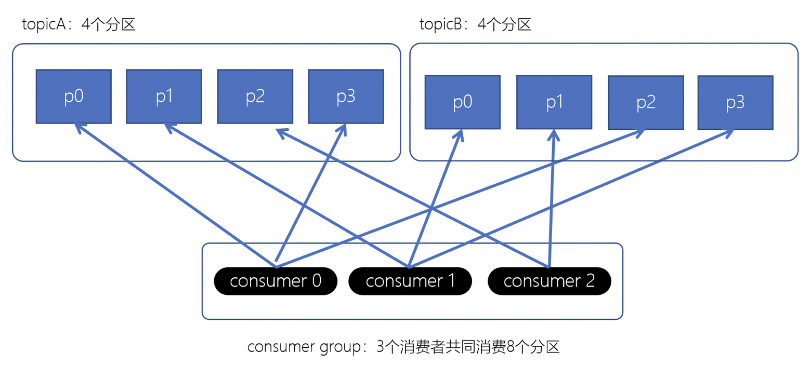
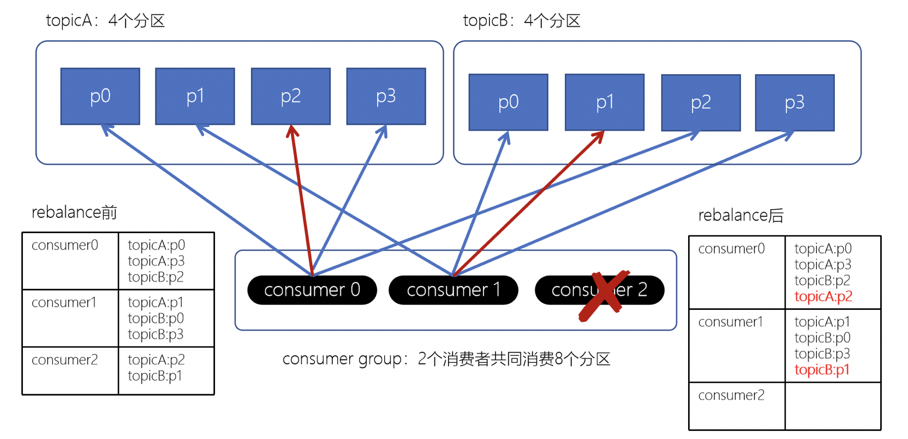
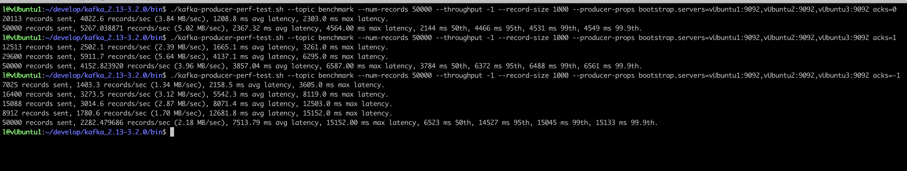

# 1 简介
## 消息队列
## 消息中间件
* 消息队列中间件就是用来存储消息的软件（组件），例如：为了分析网站的用户行为，我们需要记录用户的访问日志。这些一条条的日志，可以看成是一条条的消息，我们可以将它们保存到消息队列中。将来有一些应用程序需要处理这些日志，就可以随时将这些消息取出来处理
* 目前主流消息中间件：kafka、rabbitMQ、ActiveMQ、RocketMQ、ZeroMQ
## 应用场景
* 异步处理
    * 可以将一些比较耗时的操作放在其他系统中，通过消息队列将需要进行处理的消息进行存储，其他系统可以消费消息队列中的数据
    * 比较常见的：发送短信验证码、发送邮件
        
* 系统解耦
    * 原先一个微服务是通过接口（HTTP）调用另一个微服务，这时候耦合很严重，只要接口发生变化就会导致系统不可用
    * 使用消息队列可以将系统进行解耦合，现在第一个微服务可以将消息放入到消息队列中，另一个微服务可以从消息队列中把消息取出来进行处理。进行系统解耦
         
* 流量消峰
    * 因为消息队列是低延迟、高可靠、高吞吐的，可以应对大量并发，相当于取号排队
        
* 日志处理
    * 可以使用消息队列作为临时存储，或者一种通信管道
        
        
## 交互模型
### 请求响应模型
* `http`请求响应，如`http`前后端交互
* 数据库请求响应，如`jdbc`程序与数据库交互
### 消息模型
#### 生产者、消费者模式


* 生产者负责将消息生产到MQ中
* 消费者负责从MQ中获取消息
* 生产者和消费者是解耦的，可能是生产者一个程序、消费者是另外一个程序
#### 消息队列模式
* 点对点：一个消费者消费一个消息
    
    * 每个消息只有一个接收者（Consumer）（即一旦被消费，消息就不再在消息队列）
    * 发送者和接收者间没有依赖性，发送者发送消息之后，不管有没有接收者在运行，都不会影响到发送者下次发送消息
    * 接收者在成功接收消息之后需向队列应答成功，以便消息队列删除当前接收的消息
* 发布订阅：多个消费者可以消费一个消息
     
     * 每个消息可以有多个订阅者，被多个消费者消费
     * 发布者和订阅者之间有时间上的依赖性。针对某个主题（Topic）的订阅者，它必须创建一个订阅者之后，才能消费发布者的消息
     * 为了消费消息，订阅者需要提前订阅该角色主题，并保持在线运行

# zookeeper
提供分布式协同服务
```
# 修改conf/zoo_sample.cfg文件名为zoo.cfg，并进行相关配置
bin/zkServer.sh start #启动
bin/zkCli.sh -server 127.0.0.1:2181 # 连接到zk服务
连接到服务后
> ls /  # 查看更目录节点
> create /zk_test my_data   # 创建节点/zk_test
> get /zk_test # 获取/zk_test节点的数据
```
搭建zk集群
* zoo.conf文件中，需要添加    
    ```
    server.1=vUbuntu1:2888:3888
    server.2=vUbuntu2:2888:3888
    server.3=vUbuntu3:2888:3888
    ```
* data目录下添加各种的`myid` 

# kafka
apache kafka是一个分布式流平台，一个分布式的流平台应该包含3点关键的能力
* **发布和订阅** 流数据流，类似于消息队列或者是企业消息传递系统
* 以容错的持久化方式 **存储** 数据流
    * 和为容错的持久化方式？
* **处理** 数据流
发布与订阅、存储、处理

[官方快速启动案例](https://kafka.apache.org/quickstart)
```
# 主题类似于文件系统中的文件夹，事件是该文件夹中的文件
# 创建一个主题 topic1
./kafka-topics.sh --create --topic topic1 --bootstrap-server localhost:9092
# 查看主题
./kafka-topics.sh --describe --topic topic1 --bootstrap-server localhost:9092

# 在主题中写下一些事件
# kafka客户端通过网络与kafka brokers通信，一旦收到事件，brokers将以持久和容错的方式存储事件
./kafka-console-producer.sh --bootstrap-server localhost:9092 --topic topic1
> 这是第一个事件

# 接收事件
./kafka-console-consumer.sh --from-beginning --bootstrap-server localhost:9092 --topic topic1
```

## 集群搭建
* 先搭建zk集群
* server.properties文件配置
    * 不同的`broker.id`
    * `log.dirs`
    * `zookeeper.connect`
* 分别在每个节点启动，与单机启动方式相同
    * 启动zk集群
    * 启动kafka
        ```
        nohup ./kafka-server-start.sh ../config/server.properties >/dev/null &
        ```
* 查看集群topic
    ```
    ./kafka-topics.sh --bootstrap-server vUbuntu1:9092 --list
    ```
一键启停
* 启动脚本
    ```
    cat /home/l/develop/kafka_2.13-3.2.0/slave | while read line
    do
    {
     echo $line
     ssh $line "export JMX_PORT=9988;nohup /home/l/develop/kafka_2.13-3.2.0/bin/kafka-server-start.sh /home/l/develop/kafka_2.13-3.2.0/config/server.properties >/dev/nul* 2>&1 & "
    }&
    wait
    done
    ```
* 停止脚本
    ```
    cat /home/l/develop/kafka_2.13-3.2.0/slave | while read line
    do
    {
     echo $line
     ssh $line "jps |grep Kafka |cut -d ' ' -f1 |xargs kill -s 9"
    }&
    wait
    done 
    ```
利用[CMAK](https://github.com/yahoo/CMAK) 对集群进行管理

使用命令管理topic，若报错`java.rmi.server.ExportException: Port already in use: 9988`可在命令前尝试加上
```
unset JMX_PORT;
```

## 基准测试
基准测试（benchmark testing）是一种测量和评估软件性能指标的活动。我们可以通过基准测试，了解到软件、硬件的性能水平。主要测试负载的执行时间、传输速度、吞吐量、资源占用率等
* 测试步骤：
    1. 启动集群
    2. 创建一个1分区1副本的`topic bencmark`
        ```
        ./kafka-topics.sh --create --topic benchmark --partitions 1 --replication-factor 1
        ```
    3. 生产者测试程序
        ```
        ./kafka-producer-perf-test.sh --topic benchmark --num-records 500000 --throughput -1 --record-size 1000 --producer-props bootstrap.servers=vUbuntu1:9092,vUbuntu2:9092,vUbuntu3:9092 acks=1
        
        --num-records 500000 总共指定生产数据量50W条（默认5000W）
        --throughput -1	指定吞吐量——限流（-1不指定）
        --record-size 1000 记录数据大小（字节）
        --producer-props 指定集群，ACK模式
        ```
        * 结果：50W条数据，平均每秒发送11701.928478条（11.16M/s），平均延时2618.14 ms，最大延时5437.00 ms
            
    4. 消费者测试程序
        ```
        ./kafka-consumer-perf-test.sh --broker-list vUbuntu1:9092,vUbuntu2:9092,vUbuntu3:9092 --topic benchmark --fetch-size 1048576 --messages 5000000
        
        --fetch-size 每次拉取的数据大小
        --messages 总共要消费的消息条数
        ```
        * 结果：
            50W条数据
            共计消费的数据data.consumed.in.MB：477.0374M
            每秒消费的数量MB.sec：6.5811M
            共计消费的数量data.consumed.in.nMsg：500210条
            每秒的数量nMsg.sec：6900.7808条
            
    
各组件分区：
* redis：slot
* kafka：partition
* es：shard
* hbase：region

## 架构


### 基本概念
* broker（相当于节点）
    * 一个Kafka的集群通常由多个broker组成，这样才能实现负载均衡、以及容错
    * broker是无状态（Sateless）的，它们是通过ZooKeeper来维护集群状态
    * 一个Kafka的broker每秒可以处理数十万次读写，每个broker都可以处理TB消息而不影响性能
* zk
    * zk用来管理和协调broker，并存储了kafka的元数据（如：多少个topic、partition、consumer）
    * zk服务主要用于通知生产者和消费者kafka集群中有新的broker加入、broker故障
* topic（主题）
    * 主题要有标识符，而且是唯一的，kafka中可以有任意数量主题，没有数量上限
    * 在主题中的消息是有结构的，一般一个主题包含某一类消息
    * 一旦生产者发送消息到主题中，这些消息就不能被更新（更改）
* partition（分区）
    * 一个主题可被分为多个分区
* replicas（副本）
    * 一份数据的两份保存
    * kafka中一般会设计多个副本
* offset（偏移量）
    * offset记录着下一条将要发送给Consumer的消息的序号
    * 默认Kafka将offset存储在ZooKeeper中
    * 在一个分区中，消息是有顺序的方式存储着，每个在分区的消费都是有一个递增的id。这个就是偏移量offset
    * 偏移量在分区中才是有意义的。在分区之间，offset是没有任何意义的
* producer（生产者）
    * 数据提供者
* consumer（消费者）
    * 数据获取者
* consumer gruip（消费者组）
    * 一种机制：可扩展且具有容错性的消费者机制
    * 一个消费者组可包含多个消费者
    * 一个消费者组有一个唯一ID（group id）
    * 组内的消费者一起消费主题的所有分区数据

## kafka幂等性
幂等性：若某个系统在用户执行多次重复请求或提交后，与执行一次提交，对其影响是一样的，该系统就具有幂等性
kafka中，在生产者生产消息时，如果出现retry时，有可能会一条消息被发送了多次，如果Kafka不具备幂等性的，就有可能会在partition中保存多条一模一样的消息
kafka配置幂等性
```
props.put("enable.idempotence",true);
```
kafka幂等性原理：
* 为每个生产者设置唯一编号ProducerID
* 为某一生产者发送到指定主题分区的消息设置从0自增的`Sequence Number`
* 当kafka收到消息时，会判断ProducerID在指定主题上消息的`Sequence Number`，若相同或小于`Sequence Number`，则不存储

👻：如何演示？

## kafka事务
## 生产者分区写入策略
一个topic，可以有多个分区，写入时可以有以下几种策略
* 轮询：每个分区消息负载较均衡
    * key=null时，默认使用这张策略
* 随机（不使用）：较早版本
* 按key分配：可能会出现「数据倾斜」
* 自定义分配

> 乱序问题：同时写入多个分区，就会出现该问题

## 消费者分区分配策略
* rebalance（再均衡）
    * Consumer group下所有的consumer如何达成一致，分配订阅的topic的每个分区的机制
    * 触发条件：
        * consumer数量发生变化
        * topic发生变化
        * topic分区数量发生变化
    * 不良影响：
        * 当发生rebalance时，该组的所有消费者停止工作，知道rebalance完成

消费者分区分配策略
* range范围分配（默认）
    * 就是平均分配，多出来的（余）分给前面的
    
* RoundRobin轮询策略分配
    * 就是一一映射，不够再映射，直到分区映射完
    * 配置`partition.assignment.strategy=org.apache.kafka.clients.consumer.RoundRobinAssignor`
    
* strick粘性分配策略
    * 发生rebalance时，使分配尽可能的和上一次保持相同(粘住上一次的分配)，减少资源开销
    * 发生reblance前
    
    * 发生reblance后
    
    
## 副本机制
一份数据，在保存多分，放在不同的Broker上
生产者写入数据时，ACKs参数设置，ACKs参数设置是性能与可靠性之间的取舍设置
```
props.put("acks","all")
```
* acks=0，不等broker确认，直接发送下一条数据，性能最高，可靠性最低
* acks=1，等待broker确认，再发送下一条数据，性能中等，可靠性中等
* acks=-1/all，等到所有broker上的副本将数据同步后，才能发出下一条数据，性能最低，可靠性最高
性能可进行基准测试
```
./kafka-producer-perf-test.sh --topic benchmark --num-records 50000 --throughput -1 --record-size 1000 --producer-props bootstrap.servers=vUbuntu1:9092,vUbuntu2:9092,vUbuntu3:9092 acks=0/1/-1
```
