# kafka学习2
## 架构


## 搭建
kafka 2.8几以后版本，可不依赖zk
### zk
* zoo.conf文件中
    ```
    # 自定义数据目录
    dataDir=
    # 添加
    server.1=vUbuntu1:2888:3888
    server.2=vUbuntu2:2888:3888
    server.3=vUbuntu3:2888:3888
    ```
* data目录下添加各种的`myid`

### kafka
* server.properties文件配置
    ```
    # 不同的broker.id
    beoker.id=1/2/3
    ...
    # 自定义数据存放目录
    log.dirs=/home/l/develop/kafka_2.13-3.2.0/data
    ...
    # zk连接 
    zookeeper.connect=vUbuntu1:2181,vUbuntu2:2181,vUbuntu3:2181/kafka 
    # 最后加上/kafka可使kafka数据在zk节点中均在[/kafka]节点下
    ```


## 使用
### 命令
bin目录下，各部件可通过对应的命令去操作
* topic命令`kafka-topics.sh`

    <table width="100%" >
    <th>参数</th><th>描述</th>
    <tbody>
    <tr><td>--bootstrap-server</td>
    <td>连接的kafka broker主机地址与端口</td></tr>
    <tr><td>--topic</td><td>要操作的topic名称</td></tr>
    <tr><td>--create</td><td>创建</td></tr>
    <tr><td>--delete</td><td>删除</td></tr>
    <tr><td>--alter</td><td>修改</td></tr>
    <tr><td>--list</td><td>查看所有</td></tr>
    <tr><td>--describe</td><td>查看主题详细</td></tr>
    <tr><td>--partitions</td><td>设置分区</td></tr>
    <tr><td>--replication-factor</td><td>设置分区副本</td></tr>
    <tr><td>--config</td><td>更新系统默认的配置</td></tr>
    </tbody>
    </table>
如:
```
# 查看topic列表
./kafka-topics.sh --bootstrap-server vUbuntu1:9092 --list
# 创建topicB 2分区 2副本
./kafka-topics.sh --bootstrap-server vUbuntu1:9092 --create --topic topicB --partitions 2 --replication-factor 2
# 查看topicB详细
./kafka-topics.sh --bootstrap-server vUbuntu1:9092 --topic topicB --describe
# 修改topicA为3分区
./kafka-topics.sh --bootstrap-server vUbuntu1:9092 --topic topicA --alter --partitions 3
```
* 生产者命令`./kafka-console-producer.sh`

## kafka-生产者
### 生产者写入数据过程


### 生产者分区策略
```
producer.send(new ProducerRecord<>(topic, value), new Callback() {...}
    
# 使用默认分区规则
```
* 默认分区器`DefaultPartitioner`分区规则：
    * 如果指定分区，就使用指定的分区
    * 如果没有指定分区，但是有key，就使用key的hash值，对分区数取余，得到分区编号
    * 如果没有指定分区，也没有key，kafka采用sticky Partition(黏性分区器)，会随机选择一个分区，并尽可能的一直使用该分区，直到该分区的batch已满(16k)或时间到，kafka再随机一个分区进行使用（和上一次不同）
        
```
### 指定分区情况
public ProducerRecord(String topic, Integer partition, Long timestamp, K key, V value, Iterable<Header> headers) {
    ...
}
public ProducerRecord(String topic, Integer partition, Long timestamp, K key, V value) {
    ...
}
public ProducerRecord(String topic, Integer partition, K key, V value, Iterable<Header> headers) {
    ...
}
public ProducerRecord(String topic, Integer partition, K key, V value) {
    ...
}
### 未指定分区，但有key情况
public ProducerRecord(String topic, K key, V value) {
    ...
}
### 既没有指定分区，也没有key情况
public ProducerRecord(String topic, V value) {
    ...
}
```
    
### 生产者如何提高kafka吞吐量
1. 总缓存区大小 RecordAccumulator
2. 批次大小 batch.size
3. 轮询时间 linger.ms
4. 压缩数据 compression.type
👻：是否可在配置文件中配置，也可在代码中配置

### 生产者数据可靠性
* 数据传递语音
    * 至少一次（At Least Once）= ACK级别设置为-1 `&&` 分区副本数大于等于2 `&&` ISR里应答的最小副本数大于等于2
    * 最多一次（At Most Once）= ACK级别设置为0
    * 总结
        * 至少一次：可以保证数据不丢失，但不能保证数据不重复
        * 最多一次：可以保证数据不重复，但不能保证数据不丢失
    * 精确一次（Exactly Once）：对于一些非常重要的信息，要求数据即不能重复也不能丢失
        * Kafka 0.11 版本后，引入了一个重大特性：幂等性和事务

#### 幂等性
* 幂等性：指Producer不论向Broker发送多少次重复数据，Broker端都只会持久化一条，保证了不重复
* 精确一次（Exactly Once）= 幂等性(不重复) `&&` 至少一次(ack=-1`&&`分区副本数>=2`&&`ISR最小副本数量>=2)
* 如何判断是否重复：具有<ProducerID,Partition,SeqNumber>相同主键的消息提交时，Broker只会持久化一条。
    * PID：kafka每次重启都会分配一个新的
    * Partition：分区号
    * Sequence Number：序列化号，是单调自增的

所以幂等性只能保证的是在 **单分区** **单会话**(每次启动)内不重复

* 如何开启幂等性
    * ` map.put(ProducerConfig.ENABLE_IDEMPOTENCE_CONFIG, true);`(enable.idempotence默认为true）

#### 生产者事务
开启事务必须开启幂等性
* 生产者事务
    * 每个broker上都有一个 事务协调器（Transaction Coordinator）
    * kafka中，有一个存储事务的特殊主题`__transaction_state-分区-Leader`，默认50个分区
    * 生产者在使用事务前，必须先自定义一个唯一的事务id，有了事务id，即使客户端挂掉，重启后也能继续处理未完成的事务
    * 一条数据过来，先看是哪个分区，即用该分区的leader节点的 事务协调器 来处理该条数据 
    * 事务id的hashcode值%50，计算出该事务存在事务主题的哪个分区
    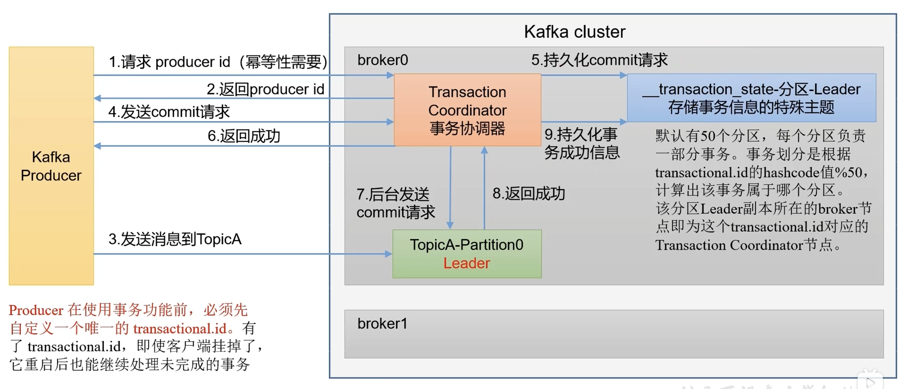
    
### 生产者保证数据有序
多分区：有办法设置为有序
单分区：有条件有序

* kafaka在1.x版本之前，保证单分区有序，条件如下
    ```
    max.in.flight.requests.per.connection=1 #把berker缓冲设置为1，默认为5
    map.put(ProducerConfig.MAX_IN_FLIGHT_REQUESTS_PER_CONNECTION, 1);
    ```
    (不需要考虑是否开启幂等性)

* kafka在1.x版本之后，保证单分区有序，条件如下
    1. 未开启幂等性
    ```
    map.put(ProducerConfig.MAX_IN_FLIGHT_REQUESTS_PER_CONNECTION, 1);
    ```
    2. 开启幂等性
    ```
    MAX_IN_FLIGHT_REQUESTS_PER_CONNECTION 小于等于5
    ```
    原因：在kafka1.x以后，启用了幂等性，kafka服务端会缓存producer发来的最近5个request的元数据，无论如何，都可以保证最近5个request的数据有序（幂等性条件，pid&分区&序列号）序列号单调递增，若有乱序数据，会进行缓存，待正常数据来后，调整顺序再落盘
    
## kafka-Broker
### zookeeper 存储的信息
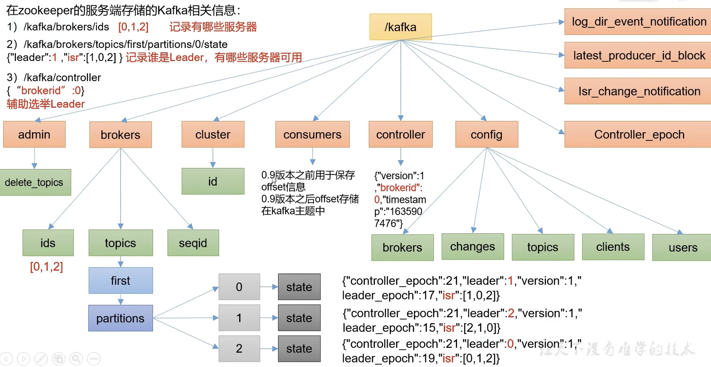

只需记住3点：
1. `ls /brokers/ids` 列出brokers
2. `get /brokers/topics/topicA/partitions/0/state` 查看某topic某分区的信息
3. `get /controller` 辅助选举Leader
 
### kafka-Broker总体工作流程
kafka启动流程：
1. 启动zk集群
2. 启动kafka各个broker：
    1）抢占`/controller`：每个broker中都有一个controller，启动成功的broker会抢占`/controller`，谁先抢到就用谁的Controller，如`{"version":1,"brokerid":1003,"timestamp":"1659239392351"}`
    2）由该Controller监听各个broker的变化：某broker启动成功，会在zk中，注册到`/brokers/ids/`中
    3）由该Controller选举出各topic的各分区对应的Leader，选举规则：在ISR中存活，按分区中的所有副本（AR）排序在先的优先，轮询，得到各topic各分区的Leader，并选举出的数据将传到zk集群中
    ```
    >get /brokers/topics/topicA/partitions/2/state
    {"controller_epoch":8,"leader":1003,"version":1,"leader_epoch":14,"isr":[1003,1001]}
    ```
    4）其他各个broker的Controller从zk中获取这些信息，随时应对`/controller`中节点挂掉的情况，准备上位
3. 假设某分区的Leader挂掉，主Controller能在`/brokers/ids/`中感知到，会从`/brokers/topics/topicA/partitions/2/state`中拉取各topic各分区的信息，重新进行选举，并更新
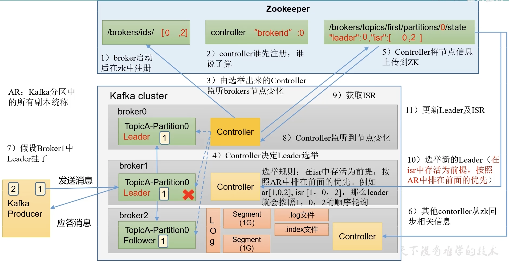

### 添加Broker
清理目录`kafka/logs`，`kafka/data`
正常配置，注意`broker.id`
正常启动

* 将原有主题进行负载均衡到新的broker
    1. 编写一个json文件`topics-to-move.json`，内容如下：
        ```
        {
            "topics":[
                {"topic":"topicA"}
            ],
            "version":1        
        }
        ```
    2. 利用文件执行命令，生成负载均衡计划
        ```
         bin/kafka-reassign-partitions.sh --bootstrap-server vUbuntu1:9092 --topics-to-move-json-file topics-to-move.json --broker-list "1,2,3,4" --generate
        ```
        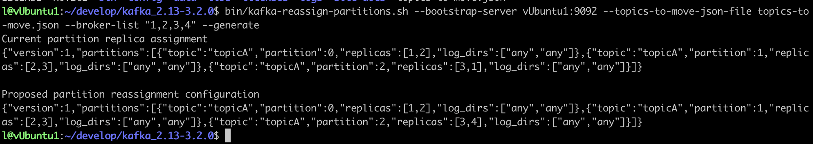
    3. 创建副本存储计划`increase-replication-factor.json`，将生成的执行计划拷贝至其中
        ```
        {"version":1,"partitions":[{"topic":"topicA","partition":0,"replicas":[1,2],"log_dirs":["any","any"]},{"topic":"topicA","partition":1,"replicas":[2,3],"log_dirs":["any","any"]},{"topic":"topicA","partition":2,"replicas":[3,4],"log_dirs":["any","any"]}]}
        ```
    4. 执行命令
        ```
         bin/kafka-reassign-partitions.sh --bootstrap-server vUbuntu1:9092 --reassignment-json-file increase-replication-factor.json --execute
        ```
    5. 验证
        ```
        bin/kafka-reassign-partitions.sh --bootstrap-server vUbuntu1:9092 --reassignment-json-file increase-replication-factor.json --verify
        ```
 之后可以直接编辑`increase-replication-factor.json`文件对副本位置分配进行修改，修改会在`/home/l/develop/kafka_2.13-3.2.0/data`中有所体现
 
### 回顾
```
一、概述
    1、定义
        1）传统定义
            分布式 发布订阅 消息队列
            发布订阅：分为多种类型 订阅者根据需求 选择性订阅
        2）最新定义
            流平台（存储、计算）
    2、消息队列应用场景
        1）缓存消峰
        2）解耦
        3）异步通信
    3、两种模式
        1）点对点
            （1）一个生产者 一个消费者 一个topic 会删数据 用得不多
        2）发布模式
            （1）多个生产者 多个消费者 相互对立 多个topic 不会删数据
    4、架构
        1）生产者
            海量数据
        2）broker
            （1）broker 就是服务器节点
            （2）topic 主题 对数据分类
            （3）partition 分区
            （4）副本 保证可靠性
                leader follower 不管生产者还是消费者 只针对leader操作
        3）消费者
            （1）消费者之间相互独立
            （2）消费者租（某个分区 只能由一个消费者消费）
        4）zookeeper
            （1）broker.ids
            （2）leader
二、入门
    1、安装
        1）broker.id 必须全局唯一
        2）配置 broker.id log.dirs zk/zkfak
        3）启动停止 先停kafka 再停zk
        4）启停脚本
            #!/bin/bash
            case $1 in
            "start")
                for i int vubuntu1 vubuntu2 vubuntu3
                do
                    ssh $i "绝对路径"
                done
            ;;
            "stop")
    2、常用命令
        1）主题 kafak-topic.sh
            (1) --bootstrap-server vUbuntu1:9092,vUbuntu2:9092
            (2) --topic topicA
            (3) --create #增
            (4) --delete #删
            (5) --alter #该
            (6) --list  #查
            (7) --describe #查
            (8) --partitions 3 # 指定分区数
            (9) --replication-factor 2 # 指定副本数
        2）生产者 kafka-console-producer.sh
            (1) --bootstrap-server vUbuntu1:9092,vUbuntu2:9092
            (2) --topic topicA
        3）消费者 kafka-console-consumer.sh
            (1) --bootstrap-server vUbuntu1:9092,vUbuntu2:9092
            (2) --topic topicA
            (3) --from-beginning
三、生产者
    1、原理
        main线程
            创建kafkaProducer
            调用 send(,) 带回调与不带回调
            拦截器
            序列化器 （java的序列化太重）
            分区器
                RecordAccumulator（32M）
                ProducerBatch（16k）
                    达到ProducerBatch或轮训时间，就被sender拉取一次
        sender线程
            一个broker一个队列
            每个队列最多缓存5个请求
            底层链路上，是selector
        broker
            分区leader收到数据 备份到副本
            对selector进行应答，acks 0 1 -1(all)
           
        sender线程
            selector收到，若成功，清除队列中的请求、清除分区气中的缓存
            若失败，则进行重试，重试次数，int最大数量
    2、异步发送API
        0）配置
            (1)连接 
            (2) 序列化器
        1）创建生产者
            KafkaProducer<String,String>()
        2）发送数据
            send() send(,new Callback)
        3）关闭资源
    3、同步发送
        send() send(,new Callback).get()
    4、分区
        （1）好处
            存储
            计算
        （2）数据发送默认分区规则
            （1）指定发送到某分区，按指定
            （2）未指定分区，有key，key取hash，对分区总输取余 得到分区数
            （3）未指定分区，无key，粘性分区
                随机，知道轮训时间或批次大小到
                切换，除上一次的外随机
        （3）自定义分区规则
            定义类，直线partitioner接口
    5、吞吐量提高
        1）提高缓存总大小（默认32m）
        2）提高批次大小(默认16k)
        3）轮训时间(默认0)
        4）压缩
    6、可靠性
        acks
            0 不等应答直接发下一个
            1 leader应答发下一个  传输普通日志
            -1 全部应答 完全可靠 副本>=2 && isr>=2       
                带来问题：数据重复
    7、数据重复
        1）幂等性
            <pid,分区号,序列号>
            默认打开
        2）事务
            底层基于幂等性
            （1）初始化
            （2）启动
            （3）消费者offset
            （4）提交
            （5）终止
    8、数据有序
        单分区内有序（有条件）
        多分区有序怎么办？
            多个拉到一起排序，还不如单分区有序
    9、乱序
        1）kafka1.0以前，请求就缓存1个
        2）kafka1.0以后
            （1）关闭幂等性，请求最多缓存1个
            （2）开启幂等性，请求最多缓存5个
四、broker
    1、zk存储了哪些
        1）broker.ids
        2）leader
        3）controller 辅助选举
    2、工作流程
    3、服役
        1）一台新服务器
        2）对哪个主题进行操作
        3）形成计划
        4）执行计划
        5）验证计划
    4、退役
```

### 副本
* 副本基本信息
    1. 作用：提高数据可靠性
    2. 默认1个副本，生产环境一般配置2个，副本太多会占用磁盘和网络资源，降低效率
    3. 副本分为Leader和Follower，生产者只与Leader交互
    4. 所有副本统称为AR（Assigned Repllicas）
        AR=ISR+OSR
        ISR：和Leader保持同步的Follower，同步周期`replica.lag.time.max.ms`,默认30s
        OSR：延时过多的副本

* 副本Leader选举规则
[副本选举规则](#kafka-Broker总体工作流程)
选举规则一定是：AR中排在前面，在ISR中的

LEO（log end offset）每个副本最后一个offset，LEO其实就是最新的offset+1
HW(High Watermark)所有副本中最小的LEO
* 当Follower挂掉时：
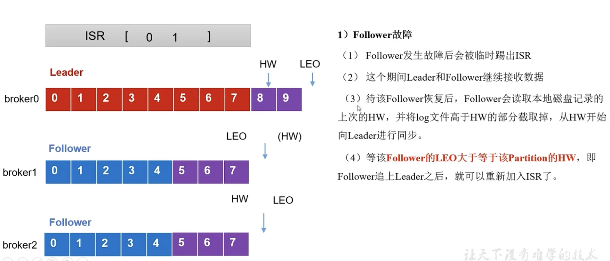

* 当Leader挂掉时：
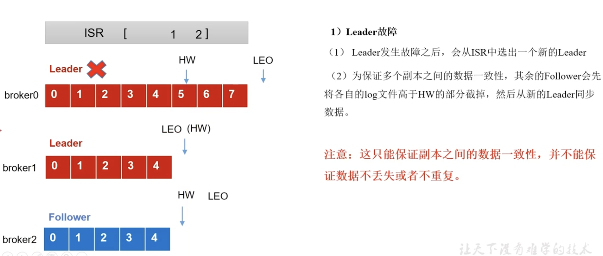

* 副本增减少
    * 参照[Broker增减](#添加Broker)

* Leader Partition 自动平衡
正常情况下，Kafak会自动把Leader均匀分布在各个机器上，保证每台机器读写均匀，但由于某些服务器宕机，可能造成不平衡
    * `auto.leader.rebalance.enable=true`,默认 自动平衡
    * `leader.imbalance.per.broker.percentage=10%`,默认，如果每个broker超过这个值，就会触发leader自动平衡
    * `leader.imbalnce.check.interval.seconds=300s`,检测周期
等了许久，未发现其自动再平衡，以下为手动再平衡方法
    ```
    unset JMX_PORT;./kafka-leader-election.sh --bootstrap-server vUbuntu1:9092 --topic topicA --partition=1 --election-type preferred
    # partition指定需要重新分配leader的partition编号
    ```
    
* 文件存储机制
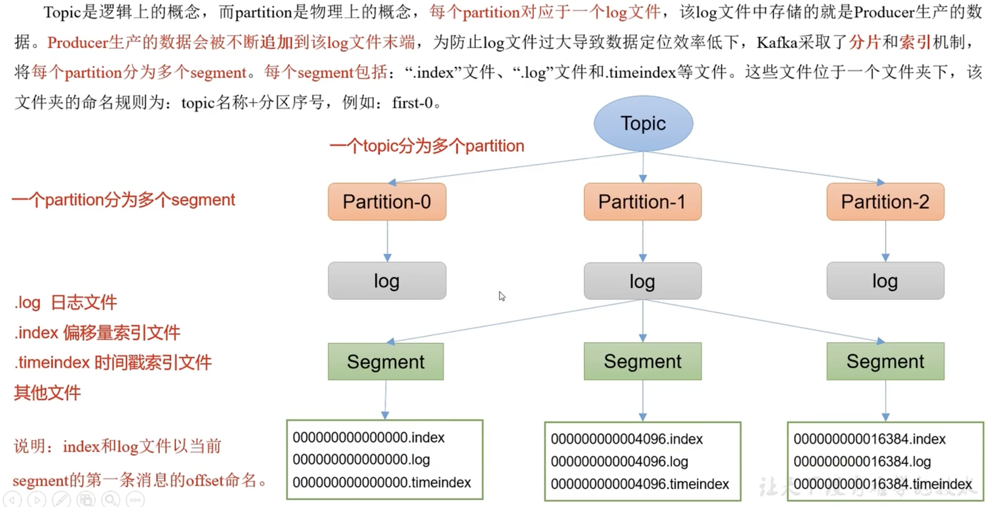

每个段segment大小默认1G `log.segment.bytes=1073741824 #1024*1024*1024`
    * 文件内容查看
        ```
        ./kafka-run-class.sh kafka.tools.DumpLogSegments --files ../data/topicA-0/00000000000000000010.log
        ```     
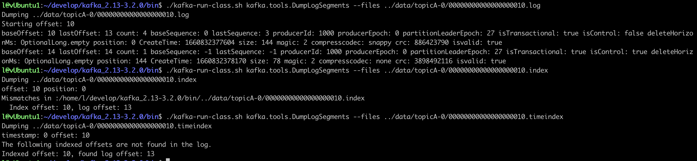
注意⚠️：
    1. index为稀疏索引，没写入4kb数据，会往index文件写入一条索引。参数log.index.interval.bytes=4kb
    2. index文件中保存的是相对offset，这样能保证offset的值所占空间不会过大
>topic=topicA,partition=1,offset=8,value=2022-08-18 22:19:36---1
topic=topicA,partition=1,offset=9,value=2022-08-18 22:19:36---4
topic=topicA,partition=1,offset=10,value=2022-08-18 22:19:36---7
topic=topicA,partition=2,offset=8,value=2022-08-18 22:19:36---2
topic=topicA,partition=2,offset=9,value=2022-08-18 22:19:36---5
topic=topicA,partition=2,offset=10,value=2022-08-18 22:19:36---8
topic=topicA,partition=0,offset=10,value=2022-08-18 22:19:36---0
topic=topicA,partition=0,offset=11,value=2022-08-18 22:19:36---3
topic=topicA,partition=0,offset=12,value=2022-08-18 22:19:36---6
topic=topicA,partition=0,offset=13,value=2022-08-18 22:19:36---9

假设现在要找`offset=12`的数据，12比`Index offset: 10, log offset: 13`中的10要大，比下一条索引的值要小，则找到对应的`position=0`,到对应的log文件中，去找到对应的`position=0`的数据，找到`offset=12`的存储位置
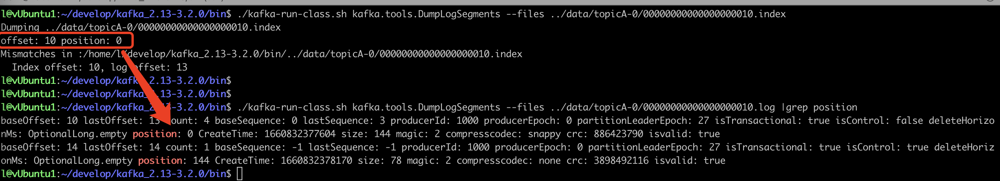

* 文件清理策略
    默认7天：
    * `log.retention.hours` 最低优先级 默认7天
    * `log.retention.minutes` 分钟
    * `log.retention.ms` 最高优先级ms
    * `log.retention.check.interval.ms` 检查周期，默认300000ms(5分钟)
    
    一旦超过设置时间，两种处理方式，delete和compact
    * delete删除
        * `log.cleanup.policy=delete` 删除策略
            1. 基于时间，默认打开，以segment中所有记录最大的时间戳为文件时间
            2. 基于大小：默认关闭，超过设置日志总大小，删除最早的segment
            `log.retention.bytes`默认-1，无穷大
    * compact压缩
        * `log.cleanup.policy=compact`压缩策略
            

* 高效读写数据
1. 分布式集群，分区技术，并行度高
2. 读数据采用稀疏索引，快速定位
3. 在磁盘中采用顺序写入
4. 页缓存+零拷贝技术
    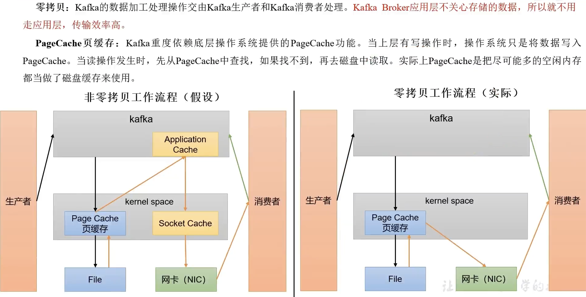
    
## kafka-消费者
### kafka消费方式
consumer采用从broker中主动拉取数据方式，每个消费者的offset存储在一个特殊的主题上`__consumer_offsets`
* 因为不同的消费者有不同的消费能力

不足之处：
* 如果kafka没有数据，消费者可能会陷入循环中，一直返回空数据
### kafka消费者工作流程
* 消费者总体工作流程
    * 对于某个主题，一个消费者，可以消费多个分区数据，一个分区，可以被多个消费者消费
    * 对于某个主题，一个消费者组中，一个分区只能被消费者组中的一个消费者消费
    * 👻：消费者组中，一个消费者可以消费多个分区吗?
        * 可以，消费者组中消费者数量小于分区数时
* 消费者组原理
    * Consumer Group（CG）：消费者组，由多个consumer组成，形成一个消费组的条件，消费者的groupid相同
        * 消费者组内，一个分区只能被消费者组中的一个消费者消费
        * 消费者组之间相互不影响，所有消费者都属于某个消费者组，即消费者组是逻辑上的一个订阅者
    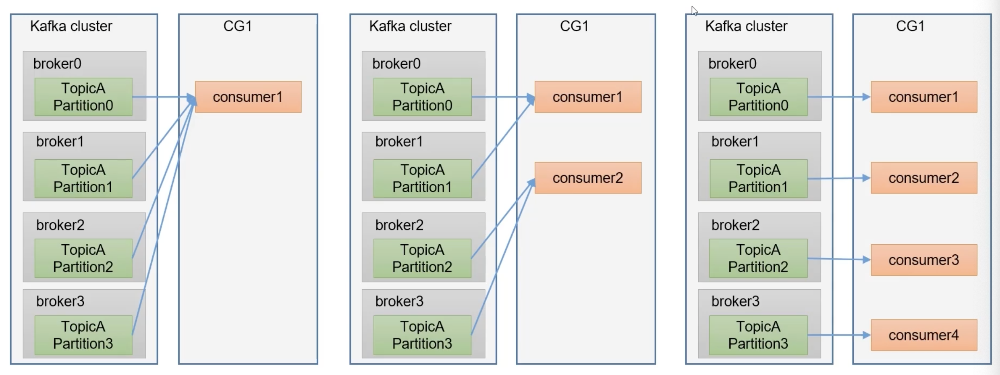
    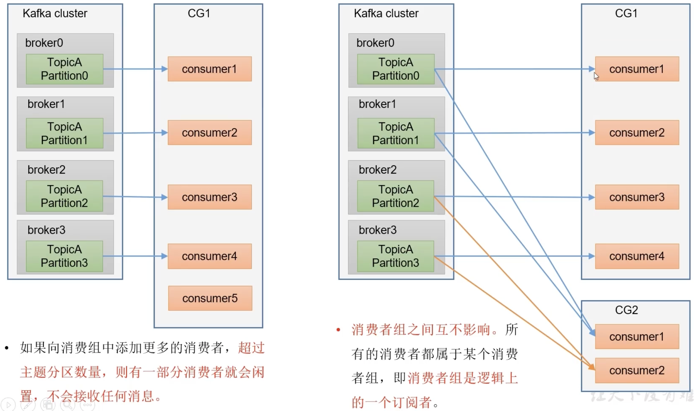
* 消费者主初始化流程
    1. 每个broker上都有一个coordinator，groupid哈希值%__consumer_offsets分区数，（取余），选定某个__consumer_offsets分区所在的broker上的coordinator
    2. 每个消费者consumer都向该coodinator发送JoinGroup请求，加入到消费者组中
    3. coodinator选定一个消费者consumer Leader，向其他发送自己收到的所有消费者信息
    4. 消费者领导consumer Leader制定一个消费方案，回传给coodinator
    5. coodinator把消费方案分发给每个消费者
    * 某消费者被除以：
        * 每个消费者和coordinator会保持心跳（默认3s），一旦超时（`session.timout.ms=45s`）,该消费者会被除以
        * 某消费者处理数据时间过长（`max.poll.interval.ms=5分钟`）
        * 消费者组中某个消费者被除以，会触发再平衡超值，其他的消费者来接替他的活
    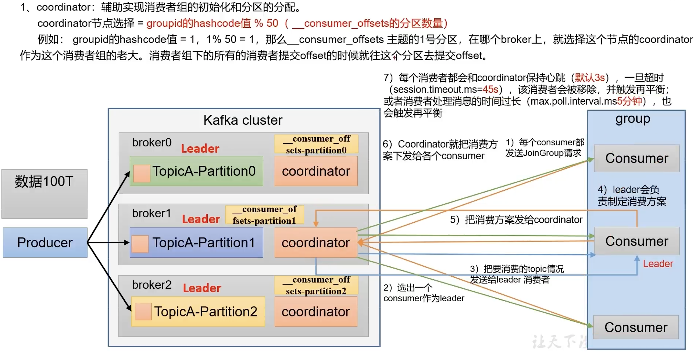
    
* 消费者组消费流程
    1. 消费者组创建一个消费者网络客户端ConsumerNetworkClient
    2. 消费者组利用网络客户端向broker发送消费抓取数据请求sendFetches，3个参数
        1. `Fetch.min.bytes`默认1字节，每批次最小抓取大小
        2. `Fetch.max.wait.ms`默认500ms，若一批次数据大小未达到最小抓取要求1字节，经过500ms照样抓取
        3. `Fetch.max.bytes`默认50M字节，每批次最大抓取数
    3. broker收到请求，通过回调方法onSuccess，把对应的结果放入其中，放入一个队列queue里
    4. 消费者组从队列中抓取数据，一次默认`Max.poll.records`500条
        1. 反序列化
        2. 拦截器
        3. 数据处理
    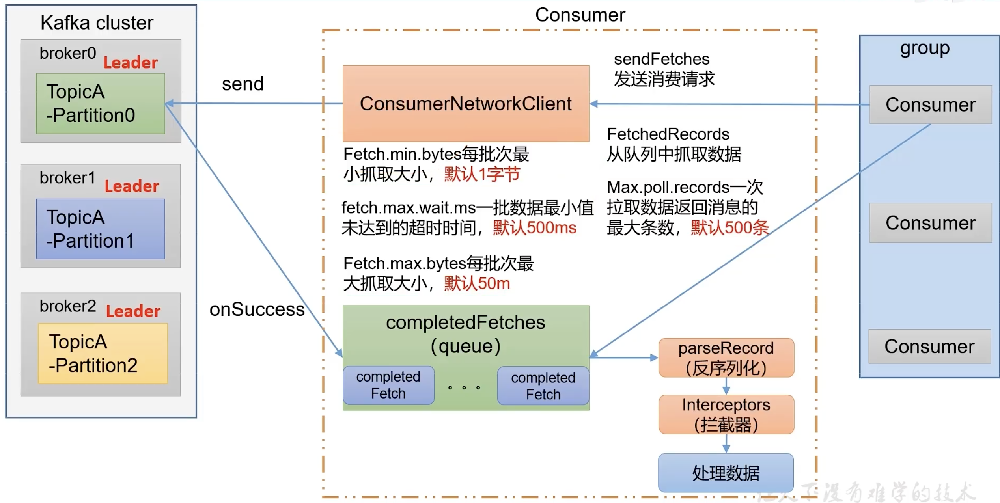
    
    
### kafkaAPI
[官方文档](https://docs.spring.io/spring-kafka/docs/current/reference/html)
* kafka生产者API，[发送消息API文档](https://docs.spring.io/spring-kafka/docs/current/reference/html/#sending-messages)
    * 使用kafkaTemplate
    * 通过kafka-clients，直接创建kafkaProducer
    * 使用DefaultKafkaProducerFactory创建Producer，需要注意不在需要Producer时，需要调用closeThreadBoundProducer()
    [样例KafkaDemo3-producer](./KafkaDemo3-producer/)
* kafka消费者API，[接收消息API文档](https://docs.spring.io/spring-kafka/docs/current/reference/html/#receiving-messages)
    * 通过kafka-clients 直接创建kafkaConsumer
    * 通过spring-kafka 创建kafkaConsumer
    * 通过kafka消息监听容器 KafkaMessageListenerContainer 配置自定义监听器
    [样例KafkaDemo3-receiver](./KafkaDemo3-receiver/)


### 生产经验-分区的分配以及再平衡
### offset位移


