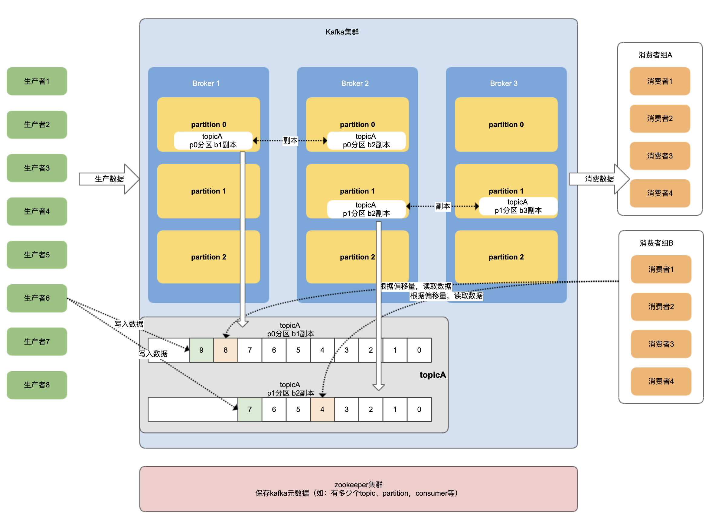
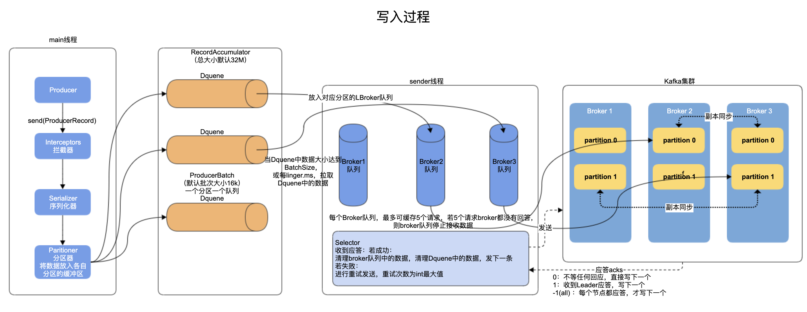

# kafka学习2
## 架构


## 搭建
kafka 2.8几以后版本，可不依赖zk
### zk
* zoo.conf文件中
    ```
    # 自定义数据目录
    dataDir=
    # 添加
    server.1=vUbuntu1:2888:3888
    server.2=vUbuntu2:2888:3888
    server.3=vUbuntu3:2888:3888
    ```
* data目录下添加各种的`myid`

### kafka
* server.properties文件配置
    ```
    # 不同的broker.id
    beoker.id=1/2/3
    ...
    # 自定义数据存放目录
    log.dirs=/home/l/develop/kafka_2.13-3.2.0/data
    ...
    # zk连接 
    zookeeper.connect=vUbuntu1:2181,vUbuntu2:2181,vUbuntu3:2181/kafka 
    # 最后加上/kafka可使kafka数据在zk节点中均在[/kafka]节点下
    ```


## 使用
### 命令
bin目录下，各部件可通过对应的命令去操作
* topic命令`kafka-topics.sh`

    <table width="100%" >
    <th>参数</th><th>描述</th>
    <tbody>
    <tr><td>--bootstrap-server</td>
    <td>连接的kafka broker主机地址与端口</td></tr>
    <tr><td>--topic</td><td>要操作的topic名称</td></tr>
    <tr><td>--create</td><td>创建</td></tr>
    <tr><td>--delete</td><td>删除</td></tr>
    <tr><td>--alter</td><td>修改</td></tr>
    <tr><td>--list</td><td>查看所有</td></tr>
    <tr><td>--describe</td><td>查看主题详细</td></tr>
    <tr><td>--partitions</td><td>设置分区</td></tr>
    <tr><td>--replication-factor</td><td>设置分区副本</td></tr>
    <tr><td>--config</td><td>更新系统默认的配置</td></tr>
    </tbody>
    </table>
如:
```
# 查看topic列表
./kafka-topics.sh --bootstrap-server vUbuntu1:9092 --list
# 创建topicB 2分区 2副本
./kafka-topics.sh --bootstrap-server vUbuntu1:9092 --create --topic topicB --partitions 2 --replication-factor 2
# 查看topicB详细
./kafka-topics.sh --bootstrap-server vUbuntu1:9092 --topic topicB --describe
# 修改topicA为3分区
./kafka-topics.sh --bootstrap-server vUbuntu1:9092 --topic topicA --alter --partitions 3
```
* 生产者命令`./kafka-console-producer.sh`

## kafka-生产者
* 生产者写入数据过程
