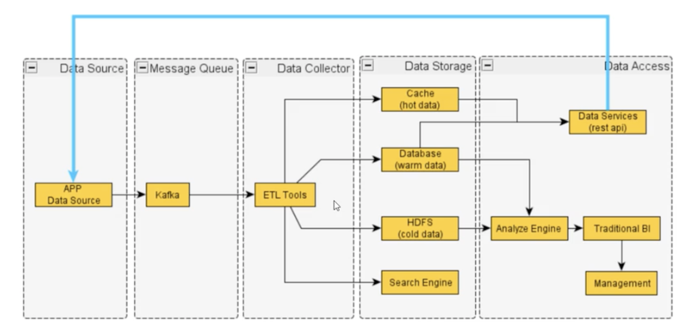
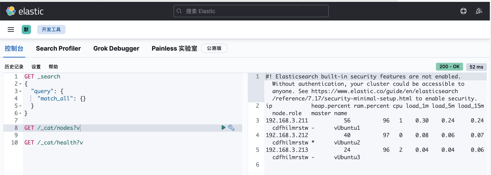

# ElasticSearch

## 基本概念
* 什么是ElasticSearch：
    ElasticSearch（简称ES）是一个**分布式**、**Resful风格的** **搜索和数据分析** 引擎，是用Java开发并且是当前最流行的开源的企业级搜索引擎，能够达到近实时搜索，稳定可靠快速安装使用方便

* 什么是倒排索引：
    * 正排索引：通过id，查找关键字，或内容
    * 倒排索引：通过关键字，查找id（有点类似非主键索引）
* Solr与ES比较：
    * Solr需要zk进行分布式管理，而ES自身带有分布式协同管理功能
    * Solr支持更多格式数据，如JSON、XML、CSV，ES只支持JSON
    * Solr对已有数据搜索较好，但实时搜索效率明显低于ES
* 通用数据处理流程：
    
    
## 集群配置
各版本下载[地址](https://www.elastic.co/cn/downloads/past-releases#elasticsearch)
### ES
* 机器环境配置
    * 使用es自带jdk`bin/elasticsearch-env`，添加以下内容
        ```
        ES_HOME=/home/l/develop/elasticsearch-7.17.9
        ES_JAVA_HOME=/home/l/develop/elasticsearch-7.17.9/jdk
        
        # 在~/.bashrc 中添加一下内容
        export ES_HOME=/home/l/app/elasticsearch-7.17.9
        export ES_JAVA_HOME=/home/l/app/elasticsearch-7.17.9/jdk
        ```
        * `config/jvm.options`文件，修改
            ```
            -Xms1g
            -Xmx1g
            ```
    * 修改最大虚拟内存`/etc/sysctl.conf`，添加以下内容
        ```
        vm.max_map_count = 655360
        ```
        执行`sysctl -p`
    * 配置es可以创建的最大线程数量`vim /etc/security/limits.conf`，添加以下内容
        ```
        es soft nofile 65535
        es hard nofile 65535
        es soft nproc 4096
        es hard nproc 4096
        ```
* 配置文件
    * `config/elasticsearch.yml`
        ```
        # 集群名
        cluster.name: my-application
        # 节点名称，每个节点名称各异 
        node.name: vUbuntu1
        # 当前节点地址
        network.host: vUbuntu1
        # 当前节点端口
        http.port: 9200
        # 注册发现节点地址
        discovery.seed_hosts: ["vUbuntu1","vUbuntu2","vUbuntu3"]
        # 各节点地址
        cluster.initial_master_nodes: ["vUbuntu1","vUbuntu2","vUbuntu3"]
        # 设置geoip为false
        ingest.geoip.downloader.enabled: false
        #允许跨域访问
        http.cors.enabled: true
        http.cors.allow-origin: "*"
        ```
* 启动
```
nohup ./bin/elasticsearch >/dev/null &
```
浏览器访问`http://vubuntu1:9200/_cat/health?v`进行查看
### Kibana
* 配置`config/kibana.yml`
    ```
    # 访问端口
    server.port: 5601
    # 访问地址
    server.host: "vUbuntu1"
    # es各节点地址
    elasticsearch.hosts: ["http://vUbuntu1:9200","http://vUbuntu2:9200","http://vUbuntu3:9200"]
    ```
* 启动`bin/kibana`
浏览器访问`http://vubuntu1:5601/app/dev_tools#/console`


## 常用命令
    ```
    /_cat/allocation    # 查看单节点shard分配整体情况
    /_cat/shards        # 查看各个shard的详细情况
    /_cat/shards/{index}    # 查看指定分片的详细情况
    /_cat/master            # 查看master节点信息
    /_cat/nodes             # 查看各node节点信息
    /_cat/tasks             # 
    /_cat/indices           # 查看集群中所有index的详细信息
    /_cat/indices/{index}   # 查看集群中指定index的详细信息
    /_cat/segments          # 查看各index的段segment详细信息,包括segment名，所属shard，磁盘占用大小，是否刷盘
    /_cat/segments/{index}  # 查看指定index的segment详细信息
    /_cat/count             # 查看当前集群的doc数量
    /_cat/count/{index}     # 查看指定索引的doc数量
    /_cat/recovery          # 查看集群内每个shard的recorvery过程，调整replica
    /_cat/recovery/{index}  # 查看指定索引的shard的recorvery过程
    /_cat/health            # 查看几圈当前状态：红、黄、绿
    /_cat/pending_tasks     # 查看当前集群的pending task
    /_cat/aliases           # 查看集群中所有alias信息，路由配置等
    /_cat/aliases/{alias}   # 查看指定索引的alias信息
    /_cat/thread_pool       # 查看各个节点内部不同类型的threadpool的统计信息
    /_cat/thread_pool/{thread_pools}     # 查看指定thread_pools的threadpool的统计信息
    /_cat/plugins                   # 查看各节点上的plugin信息
    /_cat/fielddata                 # 查看当前集群各个节点的fielddatat内存使用情况
    /_cat/fielddata/{fields}        # 查看指定field的内存使用情况，里面传field属性对应的值
    /_cat/nodeattrs                 # 查看单节点的自定义属性   
    /_cat/repositories              # 输出几圈汇总注册快照存储库
    /_cat/snapshots/{repository}    # 
    /_cat/templates                 # 查看当前正在存在的模版信息
    /_cat/ml/anomaly_detectors
    /_cat/ml/anomaly_detectors/{job_id}
    /_cat/ml/trained_models
    /_cat/ml/trained_models/{model_id}
    /_cat/ml/datafeeds
    /_cat/ml/datafeeds/{datafeed_id}
    /_cat/ml/data_frame/analytics
    /_cat/ml/data_frame/analytics/{id}
    /_cat/transforms
    /_cat/transforms/{transform_id}
    ```
## ES安装插件
以安装分词插件为例：
* 在线安装，以analysis-icu分词器为例
    ```
    # 查看已安装的插件
    bin/elasticsearch-plugin list
    
    # 安装插件analysis-icu
    bin/elasticsearch-plugin install analysis-icu 
    # 安装好的插件会在plugin/目录下
    
    # 删除插件analysis-icu
    bin/elasticsearch-plugin remove analysis-icu
    
    # 安装或删除插件后，需要重启ES才能生效
    
    测试分词效果
    POST _analyze
    {
        "analyzer":"icu_analyzer",  # 默认分词器standard
        "text":"中华人民共和国"
    }
    POST _analyze
    {
      "analyzer":"icu_analyzer",
      "text":"滚滚长江东逝水，浪花淘尽英雄。是非成败转头空。青山依旧在，几度夕阳红。白发渔樵江渚上，惯看秋月春风。一壶浊酒喜相逢。古今多少事，都付笑谈中。"
    }
    ```
* 离线安装，以analysis-ik分词器为例
    ```
    # 离线下载对应版本ik分词器
    wget https://github.com/medcl/elasticsearch-analysis-ik/releases/download/v7.17.5/elasticsearch-analysis-ik-7.17.5.zip
    # 解压到plugins/analysis-ik/目录下
    unzip elasticsearch-analysis-ik-7.17.5.zip -d analysis-ik
    # 删除zip包
    rm elasticsearch-analysis-ik-8.4.1.zip
    # 重启
    # 测试
        # ik 粗粒度分词
        POST _analyze
        {
          "analyzer":"ik_smart",
          "text":"中华人民共和国"
        }
        # ik 最大单纯分词
        POST _analyze
        {
          "analyzer":"ik_max_word",
          "text":"中华人民共和国"
        }
    ```
    * analysis-ik分词器版本号必须与es版本相同，若无相同版本，可克隆相近版本自己进行编译：
        ```
        git clone https://github.com/medcl/elasticsearch-analysis-ik
        cd elasticsearch-analysis-ik
        git pull origin 7.x
        vi pom.xml # 修改版本号
        mvn clean
        mvn compile
        mvn package
        # 进入./target/releases
        ```
## ElasticSearch vs 关系型数据库区别
* 7.0之前，一个Index可以设置多个Types，7.0开始，一个索引只能创建一个Type-"_doc"
<table>
<tr><td><b>关系型数据库</b></td><td>Table(表)</td><td>Row(行)</td><td>Column(列)</td></tr>
<tr><td><b>ElasticSearch</b></td><td>Index(索引)</td><td>Document(文档)</td><td>Field(字段)</td></tr>
</table>

## ElasticSearch操作
### 索引（Index）
* 索引是拥有相似特征的文档的集合，类似表是拥有相似特征的记录的集合
    * 比如说，可以有一个客户数据的索引，有一个产品目录的索引，还可以有一个订单数据的索引
* 索引命名必须小写，不能以下划线开头
* 一个索引由一个名字来标识(必须全部是小写字母)
    * 当我们要对对应于这个索引中的文档进行索引、搜索、更新、删除，都要用到这个名字
* 基本操作
    ```
    # 创建索引
    PUT /es_db
    
    # 查看索引结构
    GET /es_db
        
        ####### 结果 #######
        {
          "es_db" : {
            "aliases" : { },
            "mappings" : { }, // 当有数据时自动生成
            "settings" : {
              "index" : {
                "routing" : {
                  "allocation" : {
                    "include" : {
                      "_tier_preference" : "data_content"
                    }
                  }
                },
                "number_of_shards" : "1",   // 一个分片
                "provided_name" : "es_db",  // 索引名
                "creation_date" : "1680231562307",
                "number_of_replicas" : "1", // 一个副本
                "uuid" : "cwZfjyulSbqqxqpjIIoidg",
                "version" : {
                  "created" : "7170999"
                }
              }
            }
          }
        }
    
    # 查看索引mapping
    GET /es_db/_mapping
    
    # 删除索引
    DELETE /es_db
    GET /es_db/_mapping
    
    # 创建索引是可以设置分片数和副本数，3个分片，2个副本
    PUT /es_db 
    {
      "settings" : {
        "number_of_shards" : 3,
        "number_of_replicas" : 2
      }
    }
    
    # 修改索引配置
    PUT /es_db/_settings
    {
      "index":{
        "number_of_replicas" : 1
      }  
    }
    
    # 检查索引是否存在
    HEAD /es_db
    
    # 左打括号「{」必须另起一行


    
   
    ```
### 文档（Document）
* Elasticsearch是面向文档的，文档是所有可搜索数据的最小单位
    * 可以是：日志文件中的日志项/一部电影的具体信息/一张唱片的详细信息/MP3播放器里的一首歌/一篇PDF文档中的具体内容
* 文档会被序列化成JSON格式，保存在Elasticsearch中
* 文档的的每条记录都有一个唯一 ID
    * 可以用自己指定ID或ES自动生成的
* JSON文档，格式灵活，不需要预先定义格式
    * 字段类型可以指定或者通过ES自动推算
    * 支持数组/支持嵌套

    ```
    # 向es_db索引中插入一条记录(文档)，指定id
    PUT /es_db/_doc/1
    {
      "name": "小红",
      "sex": 1,
      "age": 23,
      "address": "xxxABC52号",
      "remark": "java developer"
    }

    # 向es_db索引中插入一条记录(文档)，指定id
    PUT /es_db/_doc/2
    {
      "name": "小蓝",
      "sex": 0,
      "age": 24,
      "address": "xxxABC52号",
      "remark": "java developer",
      "other1": "o"
    }
    # 查询前10条文档记录
    GET /es_db/_doc/_search
    ```
* 元数据，用于标注文档的相关信息：
    * _index: 文档记录所属的索引名
    * _type: 文档记录所属的类型名
    * _id: 文档记录唯一id
    * _version: 文档的版本号，修改删除操作version都会自增1
    * _seq_no: 和version一样，一旦数据发生更改，数据也一直是累计的，shard级别严格递增，保证后写入的Doc的seq_no大于先写入的Doc的seq_no
    * _primary_term: 用来恢复数据时处理当多个文档的_seq_no一样时的冲突，避免Primary_Shard上的写入被覆盖。每当Primary_Shard发生重新分配时，比如重启，Primary选举等，_primary_term会递增1
    * _source: 文档的原始json数据
    ```
    # 查询es_db中id为2的记录
    GET /es_db/_doc/2
        ####### 结果 #######
        {
          "_index" : "es_db",
          "_type" : "_doc",
          "_id" : "3",
          "_version" : 2,
          "_seq_no" : 2,
          "_primary_term" : 2,
          "found" : true,
          "_source" : {
            "name" : "小粉",
            "sex" : 0,
            "age" : 24,
            "address" : "xxxABC52号",
            "remark" : "java developer",
            "other1" : "o"
          }
        }
    ```
    * 并发场景下修改文档
        * seq_no和primary_term是对version的优化，7.X版本的ES默认使用这种方式控制版本，所以当在高并发环境下使用乐观锁机制修改文档时，要带上当前文档的seq_no和primary_term进行更新
            ```
            # 更新es_db中id为2的文档
            POST /es_db/_doc/2
            {
              "name":"XXX"
            }
            
            # 并发修改某记录，带上_seq_no和_primary_term更新，当两个号对应得上，才能成功更新，解决并发问题
            POST /es_db/_doc/2?if_seq_no=0&if_primary_term=2
            {
                "name":"李四"
            }
            ```
#### 文档操作
* 添加文档
    * 格式：`[PUT|POST] /[索引名称]/[_doc|_create]/[id]`
    ```
    # PUT必须指定ID，POST可以不指定ID自动生成ID，根据ID新增或覆盖(删除后添加)原有记录
    
    # 向es_db中添加一条记录（文档），id为1，各个字段如
    PUT /es_db/_doc/1
    {
      "name":"小明",
      "gender":1,
      "age":24,
      "address":"地址1",
      "remark":"java developer"
    }
    POST /es_db/_doc
    {
      "name":"小明",
      "gender":1,
      "age":24,
      "address":"地址2",
      "remark":"java developer"
    }
    
    # _create 只能用于创建新纪录
    ```
* 更新文档
* 删除文档
* 查询文档