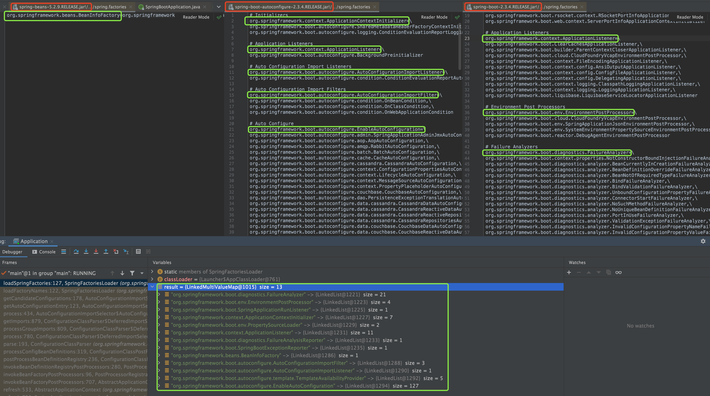
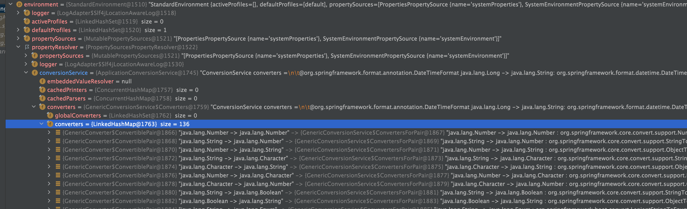
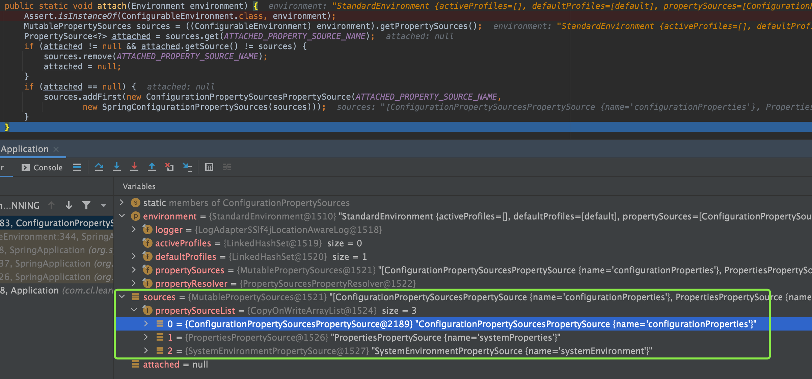

# SpringBoot 启动过程

```xml
<dependency>
    <groupId>org.springframework.boot</groupId>
    <artifactId>spring-boot-starter</artifactId>
    <version>2.3.4.RELEASE</version>
</dependency>
```
springboot 2.3.4.RELEASE 对应的spring版本是5.2.9.RELEASE

1. ```java
   @SpringBootApplication
   public class Application {
       public static void main(String[] args) {
           ConfigurableApplicationContext context = SpringApplication.run(Application.class, args);
       }
   }
   ```

   1. main方法启动运行

      1. ```java
         public static ConfigurableApplicationContext run(Class<?>[] primarySources, String[] args) {
            return new SpringApplication(primarySources).run(args);
         }
         ```

         1. SpringApplication(primarySources) 创建SpringApplication

            1. ```java
               // resourceLoader=null
               // primarySources=Application.class
               public SpringApplication(ResourceLoader resourceLoader, Class<?>... primarySources) {
                  this.resourceLoader = resourceLoader;
                  Assert.notNull(primarySources, "PrimarySources must not be null");
                  // 将Application.class 装到 primarySources Set中 主要资源
                  this.primarySources = new LinkedHashSet<>(Arrays.asList(primarySources));
                  // 判断是否是webApp类型，判断方法为看类路径中是否有servlet DispatcherServlet等
                  this.webApplicationType = WebApplicationType.deduceFromClasspath();
                  // 初始化配置，装载到当前对象（SpringApplication）的initializers中去 7个
                  setInitializers((Collection) getSpringFactoriesInstances(ApplicationContextInitializer.class));
                  // 在spring.factories中获取到ApplicationListener，实例化后，装载到Listeners中去 11个
                  setListeners((Collection) getSpringFactoriesInstances(ApplicationListener.class));
                  this.mainApplicationClass = deduceMainApplicationClass(); //推断出主启动类，并转载到mainApplicationClass中
               }
               ```

               1. 初始化配置

                  ```java
                  // type=org.springframework.context.ApplicationContextInitializer.class
                  private <T> Collection<T> getSpringFactoriesInstances(Class<T> type, Class<?>[] parameterTypes, Object... args) {
                     // 获取classloader
                     ClassLoader classLoader = getClassLoader(); 
                     // Use names and ensure unique to protect against duplicates
                     // 使用名称并确保唯一以防止重复
                     // SpringFactoriesLoader.loadFactoryNames与自动配置中加载spring.factories是同一个方法，加载类路径中的spring.factories，并取出key=org.springframework.context.ApplicationContextInitializer的值放到Set集合中，共7个
                     Set<String> names = new LinkedHashSet<>(SpringFactoriesLoader.loadFactoryNames(type, classLoader));
                     // type=ApplicationContextInitializer.class,parameterTypes=[],names={xxxInitializer,xxxInitializer...}
                     List<T> instances = createSpringFactoriesInstances(type, parameterTypes, classLoader, args, names); // 实例化
                     AnnotationAwareOrderComparator.sort(instances); // 排序
                     return instances; //返回
                  }
                  ```

                  1. ```java
                     public static List<String> loadFactoryNames(Class<?> factoryType, @Nullable ClassLoader classLoader) {
                        String factoryTypeName = factoryType.getName();
                        return loadSpringFactories(classLoader).getOrDefault(factoryTypeName, Collections.emptyList());
                     }
                     ```

                     loadSpringFactories，会加载类路径中的spring.factories文件，spring.factories共有3个，分别是

                     * spring-boot.jar/META-INF/spring.factories
                     * spring-beans.jar/META-INF/spring.factories
                     * spring-boot-autoconfigure.jar/META-INF/spring.factories

                     共有key13个，并缓存在一个Map中

                     

                  2. createSpringFactoriesInstances

                     ```java
                     private <T> List<T> createSpringFactoriesInstances(Class<T> type, Class<?>[] parameterTypes,
                           ClassLoader classLoader, Object[] args, Set<String> names) {
                        List<T> instances = new ArrayList<>(names.size());
                        for (String name : names) { // 遍历
                           try {
                              Class<?> instanceClass = ClassUtils.forName(name, classLoader); // 获取到对应的字节码
                              Assert.isAssignable(type, instanceClass);
                              Constructor<?> constructor = instanceClass.getDeclaredConstructor(parameterTypes); //反射得到parameterTypes参数构造方法，parameterTypes=[] 无参构造方法
                              T instance = (T) BeanUtils.instantiateClass(constructor, args); // 调用无参构造方法实例化对象
                              instances.add(instance); // 装入到list当中
                           }
                           catch (Throwable ex) {
                              throw new IllegalArgumentException("Cannot instantiate " + type + " : " + name, ex);
                           }
                        }
                        return instances;
                     }
                     ```

               2. setInitializers 设置初始化器s

               3. setListeners 设置监听器s

               4. deduceMainApplicationClass

                  1. ```java
                     // 推断主程序类
                     private Class<?> deduceMainApplicationClass() {
                       try {
                         // 新建一个运行时异常，这个异常不抛出，用调用这个异常的getStackTrace()方法 返回一个堆栈轨迹元素的数组，代表了这个线程的堆栈情况
                         StackTraceElement[] stackTrace = new RuntimeException().getStackTrace();
                         for (StackTraceElement stackTraceElement : stackTrace) { //遍历
                           if ("main".equals(stackTraceElement.getMethodName())) { // 运行情况中，谁有main方法
                             return Class.forName(stackTraceElement.getClassName()); // 就实例化谁，并返回
                           }
                         }
                       }
                       catch (ClassNotFoundException ex) {
                         // Swallow and continue
                       }
                       return null;
                     }
                     ```

         2. run(args)

            1. ```java
               public ConfigurableApplicationContext run(String... args) {
                  StopWatch stopWatch = new StopWatch(); // 新建一个任务记时器
                  stopWatch.start(); // 开始计时
                  ConfigurableApplicationContext context = null; // 配置的 应用上下文 
                  Collection<SpringBootExceptionReporter> exceptionReporters = new ArrayList<>(); //SpringBootExceptionReporter 用于支持 自定义上报 springAppliaction启动报错的 回调接口
                  configureHeadlessProperty(); // 时系统进入无头模式，以 提高计算效率和适配性 https://www.oracle.com/technical-resources/articles/javase/headless.html
                  SpringApplicationRunListeners listeners = getRunListeners(args); // 获取运行监听器
                  listeners.starting(); // 启动监听
                  try {
                     // 新建一个spring参数访问器 DefaultApplicationArguments，内部分为Source和String[] args
                     ApplicationArguments applicationArguments = new DefaultApplicationArguments(args); 
                     // 准备环境
                     ConfigurableEnvironment environment = prepareEnvironment(listeners, applicationArguments);
                     // 配置bean信息
                     configureIgnoreBeanInfo(environment);
                     Banner printedBanner = printBanner(environment);
                     context = createApplicationContext();
                     exceptionReporters = getSpringFactoriesInstances(SpringBootExceptionReporter.class,
                           new Class[] { ConfigurableApplicationContext.class }, context);
                     prepareContext(context, environment, listeners, applicationArguments, printedBanner);
                     refreshContext(context);
                     afterRefresh(context, applicationArguments);
                     stopWatch.stop();
                     if (this.logStartupInfo) {
                        new StartupInfoLogger(this.mainApplicationClass).logStarted(getApplicationLog(), stopWatch);
                     }
                     listeners.started(context);
                     callRunners(context, applicationArguments);
                  }
                  catch (Throwable ex) {
                     handleRunFailure(context, ex, exceptionReporters, listeners);
                     throw new IllegalStateException(ex);
                  }
               
                  try {
                     listeners.running(context);
                  }
                  catch (Throwable ex) {
                     handleRunFailure(context, ex, exceptionReporters, null);
                     throw new IllegalStateException(ex);
                  }
                  return context;
               }
               ```

               1. getRunListeners  获取运行监听器

                  1. ```java
                     private SpringApplicationRunListeners getRunListeners(String[] args) {
                        Class<?>[] types = new Class<?>[] { SpringApplication.class, String[].class };
                        return new SpringApplicationRunListeners(logger,
                              getSpringFactoriesInstances(SpringApplicationRunListener.class, types, this, args));
                     }
                     // 在spring.factories中查找key=SpringApplicationRunListener的值，放入集合，并交给SpringApplicationRunListeners(logger,Set<>)方法，在返回SpringApplicationRunListeners
                     // SpringApplicationRunListeners 是一个监听器集合
                     ```

               2. prepareEnvironment 准备环境

                  ```java
                  private ConfigurableEnvironment prepareEnvironment(SpringApplicationRunListeners listeners, ApplicationArguments applicationArguments) {
                     ConfigurableEnvironment environment = getOrCreateEnvironment(); //1 获取当前环境，一个StandardEnvironment对象，内部有个propertySources是一个List<PropertiesPropertySource>，List<String,Map<obj,obj>>，目前2个systemEnvironment和systemProperties
                  	 // environment=StandardEnvironment对象, applicationArguments.getSourceArgs()通过参数访问器，得到SourceArgs，即构造参数访问器时传入的ages
                     configureEnvironment(environment, applicationArguments.getSourceArgs()); // 2 配置环境
                     ConfigurationPropertySources.attach(environment); // 3 将环境管理的每个 PropertySource 调整为 ConfigurationPropertySource
                     listeners.environmentPrepared(environment); //4设置监听器的环境为environment
                     bindToSpringApplication(environment); //  5绑定环境到spring应用
                     if (!this.isCustomEnvironment) {
                        environment = new EnvironmentConverter(getClassLoader()).convertEnvironmentIfNecessary(environment,
                              deduceEnvironmentClass());
                     }
                     ConfigurationPropertySources.attach(environment);
                     return environment;
                  }
                  ```

                  1. getOrCreateEnvironment 获取当前环境

                  2. configureEnvironment 配置环境

                     ```java
                     protected void configureEnvironment(ConfigurableEnvironment environment, String[] args) {
                        if (this.addConversionService) { // true Conversion转变/改造
                          	// ApplicationConversionService 是 FormattingConversionService 的一种特殊化，默认配置了适用于大多数 Spring Boot 应用程序的转换器和格式化程序。
                           ConversionService conversionService = ApplicationConversionService.getSharedInstance();//获取转化器
                           // 向环境对象中设置转换器为conversionService
                           environment.setConversionService((ConfigurableConversionService) conversionService); //设置environment中的转换器为conversionService
                        }
                        configurePropertySources(environment, args);
                        configureProfiles(environment, args);
                     }
                     ```

                     1. 
                        
                     2. 

                        ```java
                        // 返回一个共享的 默认应用程序 ConversionService 实例，在需要时懒惰地构建它。
                        // ApplicationConversionService 自己内部维护者一个自己的对象，若为空，就new一个自己返回
                        // ConversionService 类型转换的服务接口
                        public static ConversionService getSharedInstance() {
                           ApplicationConversionService sharedInstance = ApplicationConversionService.sharedInstance;
                           if (sharedInstance == null) {
                              synchronized (ApplicationConversionService.class) {
                                 sharedInstance = ApplicationConversionService.sharedInstance;
                                 if (sharedInstance == null) {
                                    sharedInstance = new ApplicationConversionService();
                                    ApplicationConversionService.sharedInstance = sharedInstance;
                                 }
                              }
                           }
                           return sharedInstance;
                        }
                        ```

                     3. configurePropertySources(environment, args); 在此应用程序的环境中添加、删除或重新排序任何 PropertySource。

                        1. ```java
                           protected void configurePropertySources(ConfigurableEnvironment environment, String[] args) {
                              MutablePropertySources sources = environment.getPropertySources(); //得到一个MutablePropertySources对象,即systemEnvironment 和systemProperties
                              if (this.defaultProperties != null && !this.defaultProperties.isEmpty()) { //defaultProperties=null
                                 sources.addLast(new MapPropertySource("defaultProperties", this.defaultProperties));
                              }
                              if (this.addCommandLineProperties && args.length > 0) { // args=[]
                                 String name = CommandLinePropertySource.COMMAND_LINE_PROPERTY_SOURCE_NAME;
                                 if (sources.contains(name)) {
                                    PropertySource<?> source = sources.get(name);
                                    CompositePropertySource composite = new CompositePropertySource(name);
                                    composite.addPropertySource(
                                          new SimpleCommandLinePropertySource("springApplicationCommandLineArgs", args));
                                    composite.addPropertySource(source);
                                    sources.replace(name, composite);
                                 }
                                 else {
                                    sources.addFirst(new SimpleCommandLinePropertySource(args));
                                 }
                              }
                           }
                           ```

                     4. configureProfiles(environment, args); 配置此应用程序的哪些配置文件处于活动状态（或默认情况下处于活动状态）

                        1. ```java
                           protected void configureProfiles(ConfigurableEnvironment environment, String[] args) {
                              Set<String> profiles = new LinkedHashSet<>(this.additionalProfiles); //一个Set集合
                              profiles.addAll(Arrays.asList(environment.getActiveProfiles())); // 将环境中的Active给profiles
                              environment.setActiveProfiles(StringUtils.toStringArray(profiles)); // 再把profiles设置回去
                           }
                           ```

                  3. 将环境管理的每个 PropertySource 调整为 ConfigurationPropertySource，并允许经典的 PropertySourcesPropertyResolver 调用使用配置属性名称进行解析。（在environment的source中添加configurationProperties）

                     1. ```java
                        public static void attach(Environment environment) {
                           Assert.isInstanceOf(ConfigurableEnvironment.class, environment); // 断言:提供的对象environment是提供的类ConfigurableEnvironment.class的实例。
                           MutablePropertySources sources = ((ConfigurableEnvironment) environment).getPropertySources(); //获取sources 只有 systemEnvironment 和systemProperties
                           PropertySource<?> attached = sources.get(ATTACHED_PROPERTY_SOURCE_NAME);// get.("configurationProperties")=null
                           if (attached != null && attached.getSource() != sources) {
                              sources.remove(ATTACHED_PROPERTY_SOURCE_NAME); //如果发现不是configurationProperties，就除移
                              attached = null;
                           }
                           if (attached == null) { // 如果没有发现config类型的，
                              // 在sources第一个位置添加 configurationProperties 配置
                              sources.addFirst(new ConfigurationPropertySourcesPropertySource(ATTACHED_PROPERTY_SOURCE_NAME,
                                    new SpringConfigurationPropertySources(sources)));
                           }
                        }
                        ```

                        1. 

                  4. 设置监听器的环境为environment

                  5. 绑定环境到spring应用

                     1. ```java
                        protected void bindToSpringApplication(ConfigurableEnvironment environment) {
                           try {
                              Binder.get(environment).bind("spring.main", Bindable.ofInstance(this));
                           }
                           catch (Exception ex) {
                              throw new IllegalStateException("Cannot bind to SpringApplication", ex);
                           }
                        }
                        ```

                        1.  Binder.get(environment)

                           ```java
                           public static Binder get(Environment environment, BindHandler defaultBindHandler) {
                              Iterable<ConfigurationPropertySource> sources = ConfigurationPropertySources.get(environment);
                              PropertySourcesPlaceholdersResolver placeholdersResolver = new PropertySourcesPlaceholdersResolver(environment);
                              return new Binder(sources, placeholdersResolver, null, null, defaultBindHandler);
                           }
                           ```

         3. 

             
