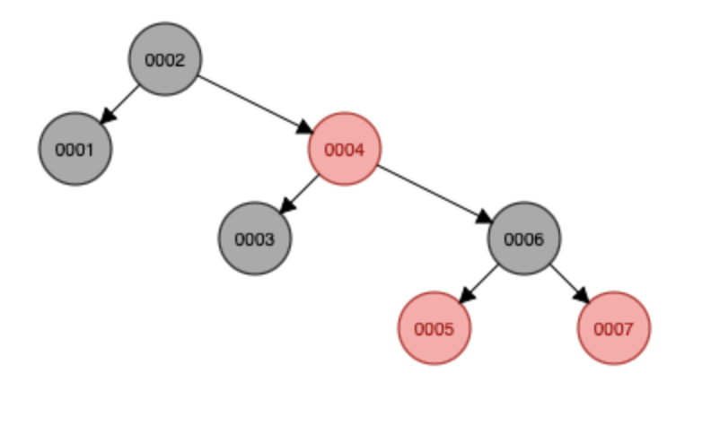
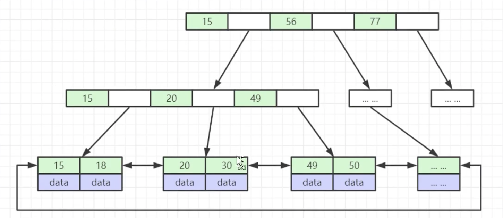
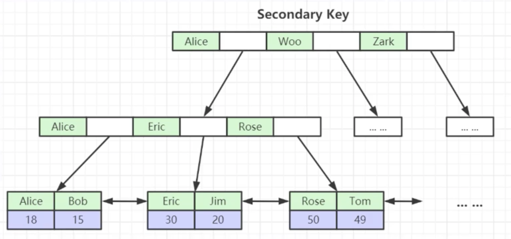

学习目标：

1. 索引数据结构红黑树，hash，B+树详解

2. 千万级数据如何用索引快速查找

3. 如何基于索引B+树精准建立高性能索引

4. 联合索引底层数据结构又是怎样的

5. 聚集索引与覆盖索引与索引下推到底是什么

6. Mysql最左前缀优化原则是怎么回事

7. 为什么推荐使用自增整型的主键而不是UUID

8. Mysql并发支撑底层BufferPool机制详解

9. 阿里巴巴Mysql索引优化军规

   

# 索引基本结构

   MySQL索引时帮助MySQL高效获取数据的 **排好序** 的 **数据结构**

   * 索引数据结构，每个节点<k,v> <索引,数据磁盘文件地址>

     * 二叉树：每个节点最多只有两个分支的有序树结构
       * 二叉查找树：本质是一种二叉树，但每个节点左子树的所有节点值均小于它的跟节点的二叉树
     * 红黑树（平衡二叉树）：叶节点高度差的绝对值不超过1，每个节点都 **带有颜色** 属性的 **二叉查找树**，
     * Hash表
     * B-Tree

     ```mysql
     # 以二叉树为例
     select * from t where t.col2=89; # 从根节点开始查找，两次就能查到
     # 但Mysql并不以二叉树为索引，因为存在问题如：
     select * from t where t.col1=6;	# col1放在二叉树里类似链表
     ```

     

     ```mysql
     # 红黑树为例 只需要查找3次
     select * from t where t.col1=6; # 早期间mysql使用平衡二叉树，现在已经不使用
     # 红黑树的问题在于数量量大时，树 的高度较高
     ```

      

     为了改进红黑树树高较高的问题，可以在一个节点里 横向 按序 多放几个元素，就形成了[B Tree](https://www.cs.usfca.edu/~galles/visualization/BTree.html)，度为4，相当于4进制，逢4分裂，每个节点最多放3个元素，每个节点最多有4个分支

     

     对B Tree再进行改进，得到[B+Tree](https://www.cs.usfca.edu/~galles/visualization/BPlusTree.html)

     

     B树和B+树区别：

     * B树叶子节点之间没有相互维护的指针
     * B+树叶子节点有冗余数据，其实冗余并不多，但可以大大提升效率

     

     B+树

     			* 非叶子节点不存储data，只存储索引(冗余)，可以放更多索引
     			* 叶子节点包含所有索引字段
     			* 叶子节点用指针连接，提高区间访问的性能

     

     ```mysql
     show global status like 'innodb_page_size';
     # 16384=1024*16
     # 每个大节点大小为16k Byte
     # mysql中int和java中int占位一样（32位4字节），bigint相当于java中的long（64位8字节）
     # 若用bigint类型的字段做索引 每个跟节点可防止16384/(8+6)=1170.2857142857个索引 
     # 若树高为h，每个叶子节点放索引和数据需要1kB，
     # 则共能放 16*(1170)^(h-1)，若h=3，=21902400
     ```


​	MyISAM 和 InnoDB 分别是mysql的两种存储引擎，存储引擎作用与表，MyISAM已经很少用了，两者都用B+树结构索引，区别在于，MyISAM 的叶子节点放索引地址，InnoDB 的叶子节点放的是整行的数据（同时放数据和索引）

 * MyISAM 有3个文件，.frm放表结构，.MYD放数据，.MYI放索引，目前MyISAM已经很少用了

 * InnoDB 两个文件，.frm放表结构，.idb放数据和索引

    * 表数据文件本身就是按B+树组织的一个索引结构文件
    * 聚集索引：叶子节点包含了完整的数据记录
    * 为什么建议InnoDB表建主键，并且推荐使用整型自增主键？（若不建主键，mysql会自己去找一列，或自己去维护一列当作索引，会消耗数据库资源。整型方便比对，自增方便范围查找）
    * 主键索引存储方式，叶子节点放索引和整行数据

    

   * 非主键索引存储方式，叶子节点放改列数据和主键。为什么？（一致性和节省存储空间）

     


Mysql索引还可以是hash索引

* 对索引的key进行一次hash计算就可以定位出数据存储的位置
* 很多时候Hash索引要比B+树索引更高效
* 仅能满足“=”，“IN”，不支持范围查询
* hash冲突问题


# 联合索引


